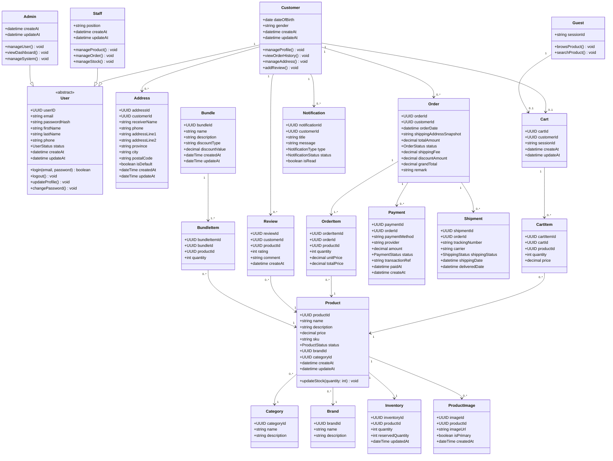
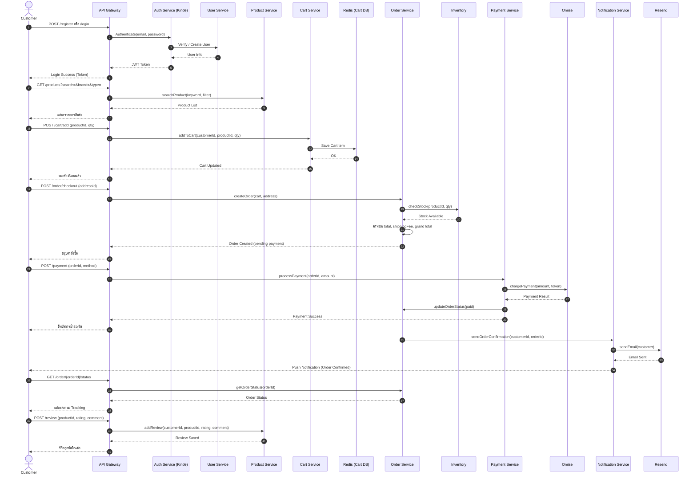
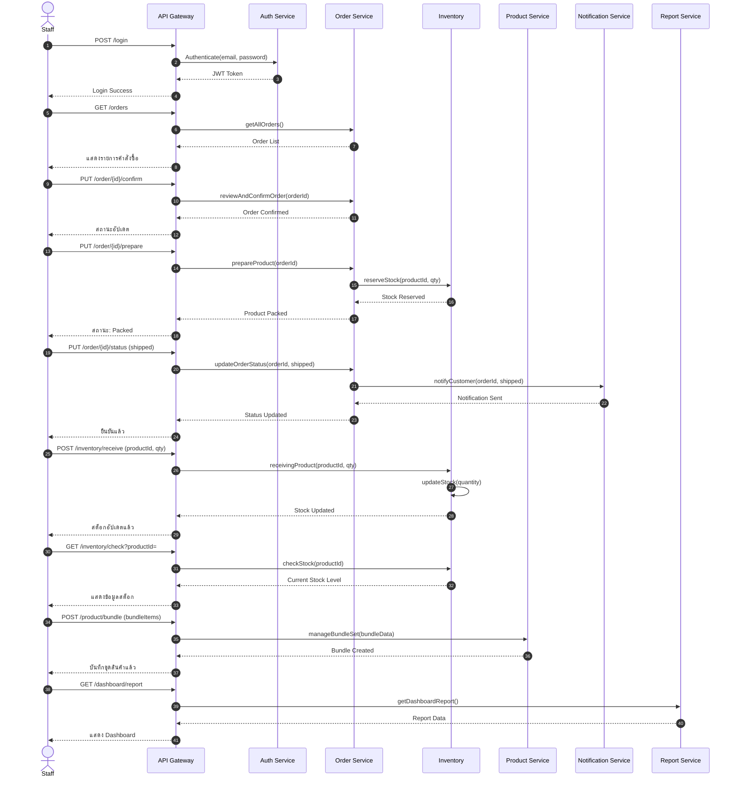
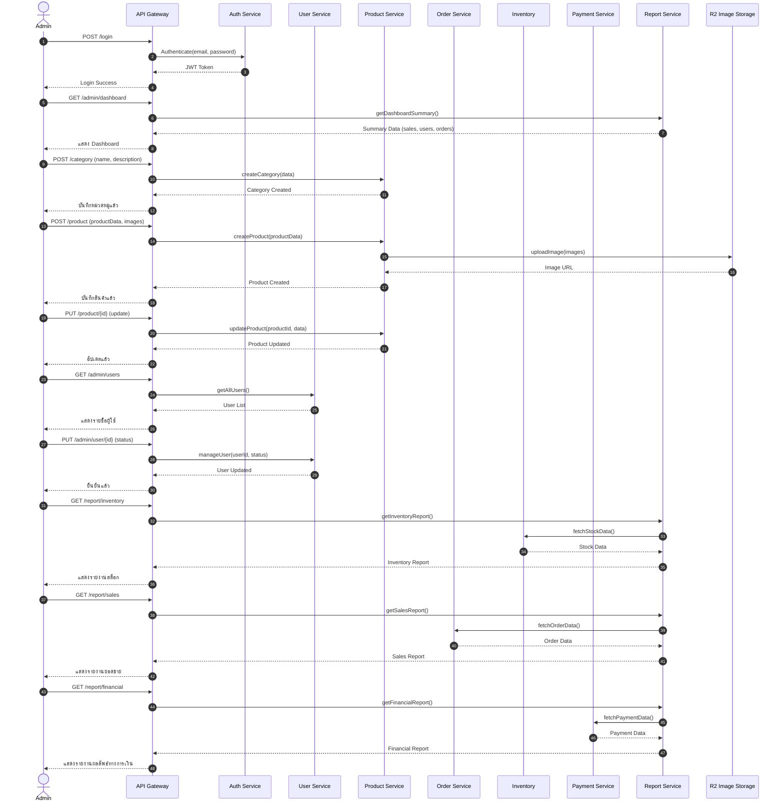
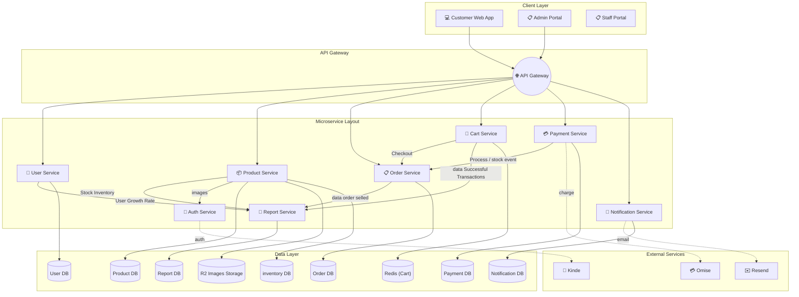

# 🎸 MusicGear — Project Design Document

> ระบบ E-Commerce สำหรับร้านขายเครื่องดนตรีและอุปกรณ์ดนตรีออนไลน์ รองรับ 4 บทบาทผู้ใช้งาน: **Guest, Customer, Staff, Admin**

---

## 📚 สารบัญ

1. [Brand Identity & Color Palette](#-brand-identity--color-palette)
2. [Logo Generation Prompt](#-logo-generation-prompt)
3. [Tech Stack](#-tech-stack)
4. [Requirement](#-requirment)
5. [User Personas](#-user-personas)
6. [Use Case Diagram](#-use-case-diagram)
7. [Class Diagram](#-class-diagram)
8. [Sequence Diagrams](#-sequence-diagrams)
9. [Wireframe](#-wire-frame)
10. [System Architecture](#-system-architecture)
11. [Data schema](#-data-schema)
12. [User Accept Testing: UAT (Manual Testing)](#-user-accept-testing-UAT-(manual-testing))

---

## 🎨 Brand Identity & Color Palette

แนวคิด: **"Electric Stage"** — ผสานความดิบเท่ของเวทีดนตรี (สีดำ/เทาเข้ม) เข้ากับความทันสมัยของแบรนด์เทค (สีฟ้าไฟฟ้า) แล้วแต่งแต้มพลังด้วยสีอำพันแบบไฟสปอตไลต์บนเวที เพื่อสื่อถึงทั้งความพรีเมียมของเครื่องดนตรีและความเป็นแพลตฟอร์มอีคอมเมิร์ซยุคใหม่

| สี | Hex | บทบาท | การใช้งาน |
|---|---|---|---|
| 🖤 **Jet Black** | `#0B0B0E` | Primary / Base | พื้นหลังหลัก, Header, Footer, โหมดมืดของเว็บ |
| 💙 **Electric Blue** | `#2F5DFF` | Primary Accent | ปุ่ม CTA, ลิงก์, โลโก้, สถานะ active, ไอคอนหลัก |
| 🧡 **Amber Spotlight** | `#FF8A3D` | Secondary Accent | ป้ายลดราคา/โปรโมชัน, แจ้งเตือน Staff/Admin, ไฮไลต์สำคัญ |
| 🤍 **Warm Off-White** | `#F5F3EE` | Surface / Background | พื้นหลังการ์ดสินค้า, พื้นที่เนื้อหาในโหมดสว่าง |
| ⚪ **Slate Gray** | `#6B6B74` | Neutral / Text | ข้อความรอง, เส้นแบ่ง, placeholder |
| 🟢 **Success Green** | `#2BBF7A` | Feedback | สถานะสำเร็จ, ของพร้อมส่ง, Payment success |
| 🔴 **Alert Red** | `#E54848` | Feedback | สต็อกหมด, ยกเลิกออเดอร์, Error |

**โทนการใช้งานแยกตามบทบาท**
- **Customer (Web App):** พื้นหลังขาวอุ่น (`#F5F3EE`) + ฟ้าไฟฟ้าเป็นจุดเด่น ให้ความรู้สึกสะอาด เลือกซื้อง่าย
- **Staff Portal:** โทนมืด (`#0B0B0E`) + อำพันเป็นตัวเน้นงาน เพื่อเน้นการอ่านสถานะ/แจ้งเตือนได้ไว
- **Admin Portal:** โทนมืด + ฟ้าไฟฟ้า เน้นกราฟ/ดาต้า ให้ดูเป็นระบบ Dashboard ระดับโปร

---

## 🧰 Tech Stack

| หมวด | เทคโนโลยี | รายละเอียด |
|---|---|---|
| **Frontend** | Next.js + TypeScript | Framework: Vinext |
| **Backend** | Node.js (JavaScript) | Runtime |
| **Backend Framework** | Hono | Lightweight backend framework |
| **ORM** | Prisma (+ adapter-neon) | จัดการฐานข้อมูล |
| **Database** | PostgreSQL (Neon DB) | Serverless Postgres |
| **Storage Images** | Cloudflare R2 | ตัวเก็บรูป |
| **Caching ** | Redis (Upstash) | สำหรับทำcart(caching) |
| **Auth** | Kinde SDK | ระบบ Authentication |
| **Validation** | Zod | Validate ข้อมูล |
| **Payment** | Omise SDK | ระบบชำระเงิน |
| **Styling** | Tailwind CSS + shadcn/ui | ออกแบบ UI และ component |
| **Deployment (Frontend)** | Cloudflare Pages | โฮสต์ฝั่ง frontend |
| **Deployment (Backend)** | Cloudflare Workers | โฮสต์ฝั่ง backend |
| **DevOps** | Wrangler CLI, Git, GitHub | Deploy & version control |
| **API Testing** | Postman | ทดสอบ API |
| **Design** | Figma | ออกแบบ UI/UX |

---

## 📃 Requirment

Requirement หลักของระบบ (ตามเกณฑ์ - ครบทุกข้อ): 

    1. การจัดการสมาชิก (Register/Login) 

    2. การจัดการข้อมูลสินค้า 

    3. การค้นหาและแสดงรายละเอียดสินค้า 

    4. ระบบตะกร้าสินค้า (Shopping Cart) 

    5. ระบบสั่งซื้อสินค้า (Order Management) 

    6. ระบบชำระเงิน (Simulation/Mockup - Stripe/Omise sandbox) 

    7. ระบบติดตามสถานะคำสั่งซื้อ 

    8. ระบบจัดการสินค้าและคำสั่งซื้อสำหรับ Staff/Admin 

    9. รายงาน/Dashboard 

    10. ระบบแนะนำอุปกรณ์ที่เหมาะสำหรับมือใหม่ (Beginner) 

    11. ระบบแนะนำสินค้าที่ใช้ร่วมกันได้ + Bundle Set 

    12. ระบบเปรียบเทียบสินค้า (Compare Product) 

    13. ระบบแจ้งเตือนทางอีเมลเมื่อสินค้าเข้าสต็อก (Back-in-stock notification)

---

## 👥 User Personas

### 🧑‍🎤 Persona 1 — Customer: "นัท"
**อายุ:** 19 ปี | นักศึกษาปีที่ 1 | **เป้าหมาย:** เล่นกีตาร์ให้เก่ง — มือใหม่ในวงการดนตรี

> *"ผมอยากหัดเล่นดนตรีจริงจัง แต่พอหาของในเน็ตทีไรก็ตัวเลือกมันแถมสเปกอะไรก็ไม่รู้ ดูเป็นไม่ค่อยรู้ว่าแค่ไหนถึงคุ้ม"*

**🩹 Pain Points**
- เลือกของไม่ถูก ตัวเลือกจัดจ้องไปหมด ไม่มีไกด์ให้มือใหม่เริ่มต้นถูกจุด
- แพ็กเกจเริ่มต้นของไม่เข้ากัน ซื้อมาแล้วต่อกันไม่ได้ อุปกรณ์ขึ้นไม่ได้กับมือใหม่
- ไม่ชัวร์เรื่องความคุ้ม ไม่รู้ว่าราคานี้มันได้ของดีจริงไหม
- ข้อมูลเทคนิคยุ่งยากเกินไป อ่านรายละเอียดสินค้าแล้วยังไม่เข้าใจ

**🎯 Needs & Motivations**
- ระบบช่วยแนะนำสินค้าเบื้องต้นที่เหมาะกับมือใหม่
- ดูค่าอธิบายแบบภาษาคนทั่วไป ไม่ต้องอิงศัพท์เทคนิคเยอะ
- จัดเซ็ตเริ่มต้นมาให้ครบ ซื้อของกล่องเดียวพร้อมเล่น
- มีให้เทียบเปรียบเทียบสินค้า เพื่อตัดสินใจซื้อง่ายขึ้น
- แพ็กเกจชัดเจนบอกว่าตัวไหนเหมาะกับระดับเริ่มต้น

---

### 🔧 Persona 2 — Staff: "นอท"
**อายุ:** 23 ปี | พนักงานดูแลคลังและจัดเตรียมสินค้า | **เป้าหมาย:** จัดเตรียมและแพ็กสินค้าให้ถูกต้อง รวดเร็ว

> *"ลูกค้าขอถามและสั่งซื้อสินค้าหลายชิ้นพร้อมกันเพราะกลัวต้องใช้ด้วยกันไม่ได้ แต่ในระบบคลังเราแยกเช็กทีละชิ้น ถ้าสินค้าชิ้นใดชิ้นหนึ่งหรือใครเข้าไปไม่ชัดเจน ระบบเวลาหยิบของมาจะวุ่นวายมาก"*

**🩹 Pain Points**
- จัดการความเข้าใจของสินค้าในสต็อกได้ไม่ตรงกัน เมื่อลูกค้าสั่งซื้อชุดสินค้าหรือจับคู่สินค้ามา Staff ต้องเสียเวลาตรวจสอบหน้างานตอนแพ็ก อุปกรณ์ขึ้นนี้สายเคิก แอมป์ มันตรงรุ่นและเข้ากันได้จริงตามที่ลูกค้าต้องการหรือไม่ เมื่อจากข้อมูลในคลังไม่ได้พูกความเข้าใจไว้ชัดเจน
- ปัญหาการตัดสต็อกสินค้าที่สัมพันธ์กัน: หากสินค้าชิ้นใดชิ้นหนึ่งในเซ็ตหมด แต่ระบบไม่แจ้งเตือนความสัมพันธ์ล่วงหน้า เสียเวลาต้องประสานงานหรือเปลี่ยนสินค้า

**🎯 Needs & Motivations**
- ระบบแจ้งข้อมูลความสัมพันธ์ของสินค้าหรือเซ็ตสต็อกสินค้าให้เข้ากันได้ ในหน้าที่สั่งซื้อชัดเจน เพื่อให้หยิบและแพ็กของได้ถูกต้อง ไม่ต้องเดาเอง
- หน้า Dashboard แสดงสถานะสต็อกของและกลุ่มสินค้าแนะนำสำหรับมือใหม่ เพื่อเตรียมแพ็กได้ล่วงหน้า

---

### 📊 Persona 3 — Admin: "แนท"
**อายุ:** 29 ปี | ผู้ดูแลระบบและจัดการคอนเทนต์สินค้า | **เป้าหมาย:** เพิ่ม ลบ แก้ไขข้อมูลสินค้า และจัดหมวดหมู่สินค้าให้เข้าใจง่าย เพื่อช่วยให้ลูกค้าตัดสินใจซื้อได้เร็วที่สุดโดยไม่ต้องลองถามเพิ่ม

> *"การจัดหมวดหมู่และละเอียดสินค้าดนตรีให้มือใหม่เข้าใจง่ายเป็นเรื่องท้าทายมาก ถ้าเราเชื่อมโยงสินค้าที่เข้ากันได้ดี ข้อมูลจะดูรกและช่วยลูกค้า"*

**🩹 Pain Points**
- ความยุ่งยากในการซื้อโยงหมวดหมู่สินค้า: การลงข้อมูลสินค้าเพื่อตอบโจทย์ความเข้ากันได้ ทำได้ยาก เพราะระบบเดิมต้องใส่รายละเอียดแยกกัน ทำให้ Admin ต้องพิมพ์ข้อความเทคนิคซ้ำๆ ในทุกหน้าสินค้า แทนที่จะสามารถผูกแท็ก ระดับสินค้ามือใหม่หรือจัดกลุ่มหมวดหมู่ที่เกี่ยวข้องกันได้ในที่เดียว
- การสกัดข้อมูลรายงานเพื่อจัดเตรียมสินค้า: เมื่อต้องการดูว่าสินค้าไหนขายดีพื้นที่นำมาจับเซ็ตโปรโมชัน ระบบรายงานไม่แยกแยะตามระดับผู้ใช้งาน ทำให้จัดเตรียมสินค้าเข้าใจยาก

**🎯 Needs & Motivations**
- ฟังก์ชันการจัดการหมวดหมู่ (Category Management) ที่รองรับใส่ป้ายกำกับ (เช่น "ระดับเริ่มต้น ราคาเป็นมิตร") หรือผูกสินค้าที่เกี่ยวข้องกันเข้าไว้ได้ในที่เดียว
- รายงานสินค้าคงคลัง (Inventory Report) ที่สรุปได้ว่าสินค้าคู่ไหนมักจะถูกซื้อร่วมกัน เพื่อนำมาปรับปรุงข้อมูลหน้าให้ตรงกับผู้ใช้งาน

---

## 🧩 Use Case Diagram


---

## 🏗️ Class Diagram



---

## 🔁 Sequence Diagrams

### 1. Customer



### 2. Staff



### 3. Admin



---

## 🖥️ System Architecture



---

## 🎯 Wireframe / Prototype - Clik to inspect
[](https://www.figma.com/design/RSQ1FfYVF5qJZzgem9ntBt/Untitled?node-id=0-1&t=H5nnEYQtm8Cw6YVe-1)

# Data Schema (JSON)
```json
{
  "name": "string",
  "age": "integer",
  "isActive": "boolean"
}
```

# User Acceptance Testing: UAT (Manual Testing)


---

> 💡 **Tip:** เมื่อได้ผลลัพธ์จาก Stitch แล้ว สามารถ copy โทนสี (`#0B0B0E`, `#2F5DFF`, `#FF8A3D`, `#F5F3EE`) ไปตั้งเป็น CSS variables ใน Tailwind config เพื่อให้ดีไซน์ทุกหน้าจอสอดคล้องกันทั้งระบบ
