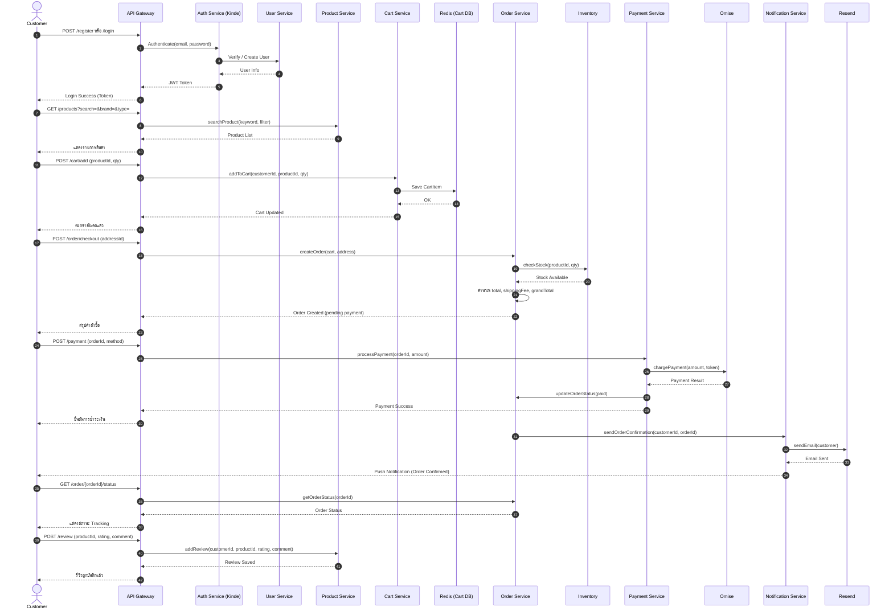
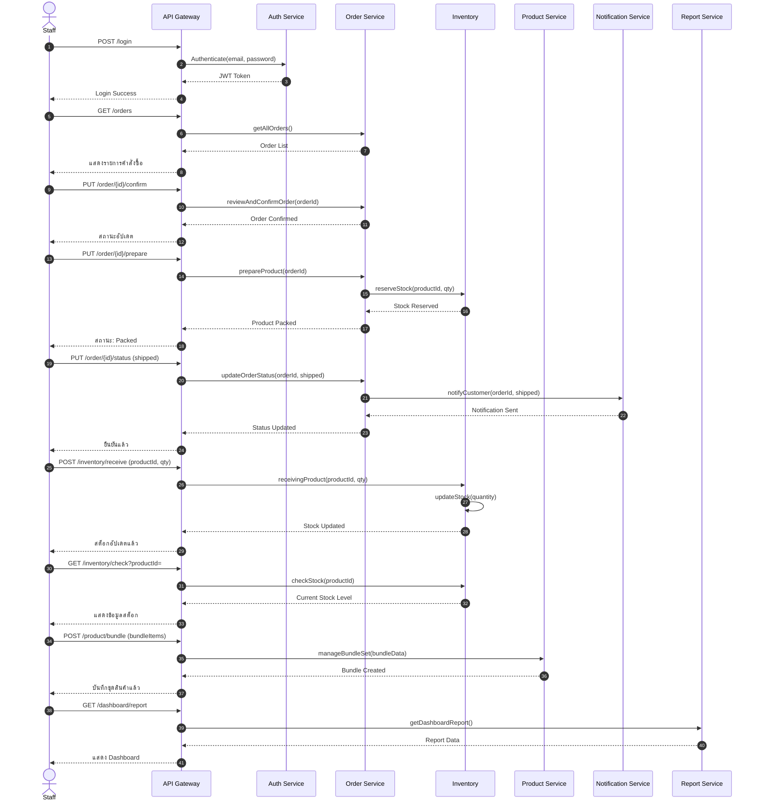
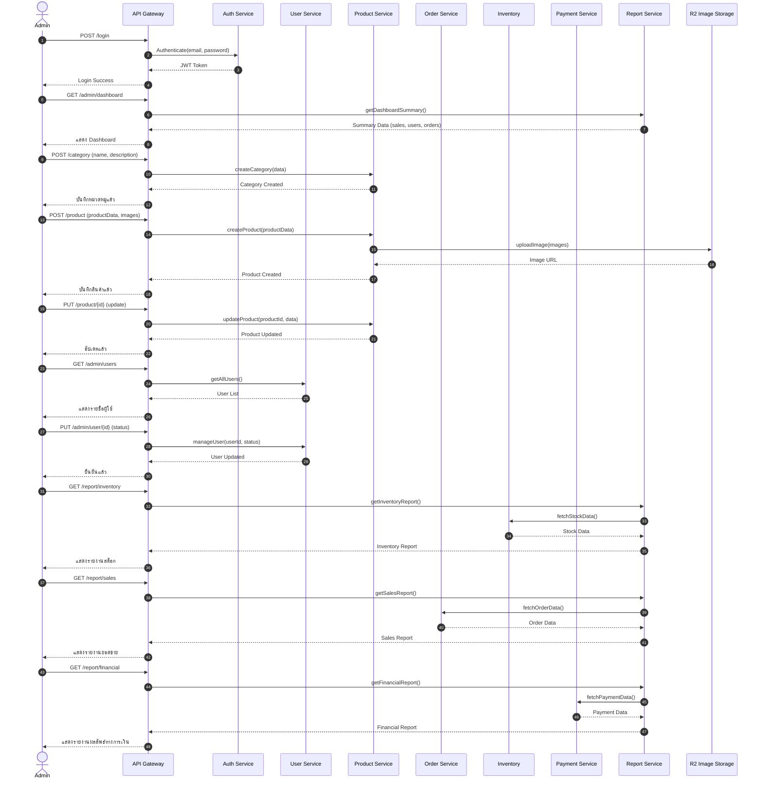
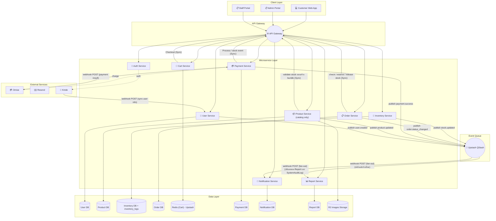

# 🎸 MusicGear — Project Design Document
> ## Project of CSI 204 Summer Semester 3/2568

> ระบบ E-Commerce สำหรับร้านขายเครื่องดนตรีและอุปกรณ์ดนตรีออนไลน์ รองรับ 3 บทบาทผู้ใช้งาน: **Customer, Staff, Admin**

github page: [GitHub Page](https://csi204.github.io/musicgear/)

---

## 📚 สารบัญ

1. [Contributors](#-contributors)
2. [หลักการและเหตุผล (Rationale)](#-หลักการและเหตุผล-rationale)
3. [วัตถุประสงค์ของโครงงาน (Objectives)](#%EF%B8%8F-วัตถุประสงค์ของโครงงาน-objectives)
4. [ขอบเขตของระบบ (System Scope)](#-หลักการและเหตุผล-rationale)
5. [แนวทางของการพัฒนาตาม SDLC (System Development Life Cycle))](#%E2%80%8D-แนวทางของการพัฒนาตาม-sdlc-system-development-life-cycle)
7. [Tech Stack](#-tech-stack)
8. [แนวทางการทดสอบ (Testing Approach)](#%EF%B8%8F-แนวทางการทดสอบ-testing-approach)
9. [ผลลัพธ์ที่คาดว่าจะได้รับ (Expected Outcomes)](#%EF%B8%8F-ผลลัพธ์ที่คาดว่าจะได้รับ-expected-outcomes)
10. [แผนการดำเนินงาน 4 สัปดาห์ (Work Plan: 4 Weeks)](#%EF%B8%8F-แผนการดำเนินงาน-4-สัปดาห์-work-plan-4-weeks)
11. [Brand Identity & Color Palette](#-brand-identity--color-palette)
12. [Requirement](#-requirment)
13. [User Personas](#-user-personas)
14. [Use Case Diagram](#-use-case-diagram)
15. [Class Diagram](#%EF%B8%8F-class-diagram)
16. [Sequence Diagrams](#-sequence-diagrams)
17. [Wireframe](#-wireframe--prototype---clik-to-inspect)
18. [System Architecture](#%EF%B8%8F-system-architecture)
19. [Data schema](#data-schema-json)
20. [User Accept Testing: UAT (Manual Testing)](#user-acceptance-testing-uat-manual-testing)

---

## 🤼 Contributors

### Group Name : องครักษ์พิทักษ์ลาบ
1. 67095474 นายธีรภัทร เนียมสุวรรณ SA, Core Backend
2. 67096366 นายปวริศ ธรรมวงษ์ Frontend, Backend lead
3. 67118456 นายเขตโสภณ อินอุตออน PM, infrastructure

---

## 💭 หลักการและเหตุผล (Rationale)

ปัจจุบันตลาดเครื่องดนตรีและอุปกรณ์ ออนไลน์มีการขยายตัวสูง แต่ร้านค้าส่วนใหญ่ยังขาดแพลตฟอร์มที่มี การจัดการที่ครอบคลุมครบวงจรยังมีน้อยอยู่ โครงงานนี้จึงมุ่งพัฒนาระบบด้วยสถาปัตยกรรม Microservices ที่มีความสามารถในการรองรับการขยายตัวของระบบได้ดี เพื่อจัดการ สต๊อกสินค้า, ระบบชำระเงินที่ปลอดภัย, และเพิ่มการดึงดูดความสนใจของผู้ใช้ ผ่านระบบแนะนำสินค้าและ Bundle Set

---

## 🗃️ วัตถุประสงค์ของโครงงาน (Objectives)

1. เพื่อพัฒนาระบบรวบรวมและจัดเก็บข้อมูลอุปกรณ์ดนตรีจากแหล่งข้อมูลออนไลน์ให้อยู่ในรูปแบบที่เป็นระบบ
2. เพื่อพัฒนาระบบแนะนำอุปกรณ์ดนตรีสำหรับผู้เริ่มต้น โดยพิจารณาจากความต้องการและงบประมาณของผู้ใช้งาน
3. เพื่อช่วยลดความสับสนในการเลือกซื้ออุปกรณ์ดนตรี และเพิ่มความมั่นใจในการตัดสินใจของผู้ใช้งาน

---

## 📑 ขอบเขตของระบบ (System Scope)

### ผู้ใช้งาน (Actors)
- [x] ลูกค้า (Customer)
- [x] พนักงาน (Staff)
- [x] ผู้ดูแลระบบ (Administrator)

### ความสามารถหลักของระบบ (Main Function)
1. การจัดการสมาชิก (Register/Login)
2. การจัดการข้อมูลสินค้า
3. การค้นหาและแสดงรายละเอียดสินค้า
4. ระบบตะกร้าสินค้า (Shopping Cart)
5. ระบบสั่งซื้อสินค้า (Order Management)
6. ระบบชำระเงิน (Simulation/Mockup - Stripe/Omise sandbox)
7. ระบบติดตามสถานะคำสั่งซื้อ
8. ระบบจัดการสินค้าและคำสั่งซื้อสำหรับ Staff/Admin
9. รายงาน/Dashboard
10. ระบบแนะนำอุปกรณ์ที่เหมาะสำหรับมือใหม่ (Beginner)
11. ระบบแนะนำสินค้าที่ใช้ร่วมกันได้ + Bundle Set
12. ระบบเปรียบเทียบสินค้า (Compare Product)
13. ระบบแจ้งเตือนทางอีเมลเมื่อสินค้าเข้าสต็อก (Back-in-stock notification)

---

## 🧑‍💻 แนวทางของการพัฒนาตาม SDLC (System Development Life Cycle)

| ขั้นตอน (Phase) | รายละเอียดโดยย่อ (Brief Description) |
|---|---|
| **1.Planing** | กำหนด Scope และประเมิน ความเป็นไปได้ ของโปรเจกต์ |
| **2.Analysis** | มีการกำหนดความต้องการและระบุขอบเขตของการพัฒนาโดยนำ UMLมาใช้วิเคราห์ เช่น Class diagram, Use case diagram, Sequence diagram  |
| **3.Design** | ออกแบบฐานข้อมูลโดยใช้ ER diagramมาช่วยออกแบบหน้าบ้านผู้ใช้โดยการนำFigmaเข้ามาช่วย ออกแบบหลังบ้านโดยใช้การออกแบบsystem architecture เข้ามาช่วย |
| **4.Development** | ลงมือ Implement เขียนโค้ดสร้างระบบ สร้างฐานข้อมูล เขียนโค้ดส่วนหน้าและหลังบ้าน ตามที่วิเคราะห์ไว้ |
| **5.Testing** | Testด้วยมือด้วยวิธีการการ UAT |
| **6.Deployment** | เอาโค้ดขึ้น Production สภาพแวดล้อมระบบที่ใช้งานจริงให้Users เข้ามาใช้ |
| **7.Maintenance** | คอย Monitor ติดตาม ระบบ อัปเดตเวอร์ชัน และแก้ไขปัญหา หลังเปิดใช้งาน |

---

## 🧰 Tech Stack

| หมวด | เทคโนโลยี | รายละเอียด |
|---|---|---|
| **Frontend** | Next.js + TypeScript | Framework: Vinext |
| **Backend** | Node.js (JavaScript) | Runtime |
| **Backend Framework** | Hono | Lightweight backend framework |
| **ORM** | Prisma (+ adapter-neon) | จัดการฐานข้อมูล |
| **Database** | PostgreSQL (Neon DB) | Serverless Postgres |
| **Storage Images** | Cloudflare R2 | ตัวเก็บรูป |
| **Caching** | Redis (Upstash) | สำหรับทำcart(caching) |
| **Auth** | Kinde SDK | ระบบ Authentication |
| **Validation** | Zod | Validate ข้อมูล |
| **Payment** | Omise SDK | ระบบชำระเงิน |
| **Styling** | Tailwind CSS + shadcn/ui | ออกแบบ UI และ component |
| **Deployment (Frontend)** | Cloudflare Pages | โฮสต์ฝั่ง frontend |
| **Deployment (Backend)** | Cloudflare Workers | โฮสต์ฝั่ง backend |
| **DevOps** | Wrangler CLI, Git, GitHub | Deploy & version control |
| **API Testing** | Postman | ทดสอบ API |
| **Design** | Figma | ออกแบบ UI/UX |
| **Version Control** | GIT,GitHub | History,VersionControl |

---

## ⚙️ แนวทางการทดสอบ (Testing Approach)
### ประเภทการทดสอบ (Test Types)
- **User Acceptance Testing (UAT)**
### เครื่องมือที่ใช้คือ (Tools)
- **Manual Testing**
### รายละเอียดการทดสอบ (Testing Details)
- **ไม่วัดผลจากการใช้เครื่องมือทดสอบอัตโนมัติ หรือการจัดทำรายงานผลการทดสอบอย่างเป็นทางการ**
- การทดสอบการทำงานของระบบ โดยอธิบายขั้นตอนการทดสอบ ผลลัพธ์ที่คาดหวัง และผลลัพธ์ที่เกิดขึ้นจริง เพื่อแสดงให้เห็นว่าระบบสามารถทำงานได้ถูกต้องตามวัตถุประสงค์ที่กำหนดไว้ รวมถึงการทดสอบการทำงานของระบบด้วยตนเอง (Manual Testing) ตามฟังก์ชันต่าง ๆ ที่ได้พัฒนาขึ้น พร้อมทั้งสาธิตการทำงานของระบบต่อผู้สอน เพื่อยืนยันความถูกต้อง ความสมบูรณ์ และประสิทธิภาพของระบบในการใช้งานจริง

---

## 🖼️ ผลลัพธ์ที่คาดว่าจะได้รับ (Expected Outcomes)
### ระบุประโยชน์ที่คาดว่าจะได้รับจากการพัฒนาระบบ
- **ได้เว็บแอป e-commerce สำหรับขาย music gear ที่ใช้งานได้จริงครบ flow ตั้งแต่ค้นหาสินค้า → ตะกร้า → ชำระเงิน สำเร็จ**
- **ผู้ใช้ (ลูกค้า/พนักงาน/แอดมิน) สามารถเข้าระบบตาม role ของตนเองได้ พร้อม Dashboard สรุปข้อมูลเชิงวิเคราะห์สำหรับแอดมิน**
- **ระบบจัดการสต็อกสินค้าที่อัปเดตสถานะอัตโนมัติเมื่อมีการสั่งซื้อ ลดความผิดพลาดจากการจัดการสต็อกแบบ manual**
- **ทีมได้ฝึกกระบวนการพัฒนาตาม Agile/Scrum จริง (4 sprints) และได้ codebase ที่ deploy บน Cloudflare stack ตามที่ออกแบบไว้**

---

## 🗺️ แผนการดำเนินงาน 4 สัปดาห์ (Work Plan: 4 Weeks)
| สัปดาห์ (Week) | กิจกรรม (Activities) | รายละเอียดโดยย่อ (Brief Description) |
|:---:|---|---|
| **1** | **วิเคราะห์และออกแบบระบบ (Analysis & Design)** | วางแผนว่าจะทำอะไร แบ่งหน้าที่ ออกแบบdiagram ออกแบบtech stack ทำยังไงให้เว็บเร็วและ setup file |
| **2** | **พัฒนา Frontend (Frontend development)** | ทำตามprototype ที่ทำไว้ และรอต่อapi จาก backendจากนั้น deploy |
| **3** | **พัฒนา Backend และฐานข้อมูล (Backend & Database Development)** | ทำตามwork flow ที่กำหนดไว้ และtest api เพื่อนำไปต่อกับ frontend และต่อdatabase จากนั้นdeploy |
| **4** | **ทดสอบระบบและนำเสนอผลงาน (Testing & Presentation)** | เตรียมการนำเสนอ และ ทดสอบUAT ตามส่วนที่ตัวเองรับผิดชอบ |

---

## 🎨 Brand Identity & Color Palette

แนวคิด: **"Electric Stage"** — ผสานความดิบเท่ของเวทีดนตรี (สีดำ/เทาเข้ม) เข้ากับความทันสมัยของแบรนด์เทค (สีฟ้าไฟฟ้า) แล้วแต่งแต้มพลังด้วยสีอำพันแบบไฟสปอตไลต์บนเวที เพื่อสื่อถึงทั้งความพรีเมียมของเครื่องดนตรีและความเป็นแพลตฟอร์มอีคอมเมิร์ซยุคใหม่

| สี | Hex | บทบาท | การใช้งาน |
|---|---|---|---|
| 🖤 **Jet Black** | `#0B0B0E` | Primary / Base | พื้นหลังหลัก, Header, Footer, โหมดมืดของเว็บ |
| 💙 **Electric Blue** | `#2F5DFF` | Primary Accent | ปุ่ม CTA, ลิงก์, โลโก้, สถานะ active, ไอคอนหลัก |
| 🧡 **Amber Spotlight** | `#FF8A3D` | Secondary Accent | ป้ายลดราคา/โปรโมชัน, แจ้งเตือน Staff/Admin, ไฮไลต์สำคัญ |
| 🤍 **Warm Off-White** | `#F5F3EE` | Surface / Background | พื้นหลังการ์ดสินค้า, พื้นที่เนื้อหาในโหมดสว่าง |
| ⚪ **Slate Gray** | `#6B6B74` | Neutral / Text | ข้อความรอง, เส้นแบ่ง, placeholder |
| 🟢 **Success Green** | `#2BBF7A` | Feedback | สถานะสำเร็จ, ของพร้อมส่ง, Payment success |
| 🔴 **Alert Red** | `#E54848` | Feedback | สต็อกหมด, ยกเลิกออเดอร์, Error |

**โทนการใช้งานแยกตามบทบาท**
- **Customer (Web App):** พื้นหลังขาวอุ่น (`#F5F3EE`) + ฟ้าไฟฟ้าเป็นจุดเด่น ให้ความรู้สึกสะอาด เลือกซื้อง่าย
- **Staff Portal:** โทนมืด (`#0B0B0E`) + อำพันเป็นตัวเน้นงาน เพื่อเน้นการอ่านสถานะ/แจ้งเตือนได้ไว
- **Admin Portal:** โทนมืด + ฟ้าไฟฟ้า เน้นกราฟ/ดาต้า ให้ดูเป็นระบบ Dashboard ระดับโปร

---

## 📃 Requirment

Requirement หลักของระบบ (ตามเกณฑ์ - ครบทุกข้อ):
1. การจัดการสมาชิก (Register/Login)
2. การจัดการข้อมูลสินค้า
3. การค้นหาและแสดงรายละเอียดสินค้า
4. ระบบตะกร้าสินค้า (Shopping Cart)
5. ระบบสั่งซื้อสินค้า (Order Management)
6. ระบบชำระเงิน (Simulation/Mockup - Stripe/Omise sandbox)
7. ระบบติดตามสถานะคำสั่งซื้อ
8. ระบบจัดการสินค้าและคำสั่งซื้อสำหรับ Staff/Admin
9. รายงาน/Dashboard
10. ระบบแนะนำอุปกรณ์ที่เหมาะสำหรับมือใหม่ (Beginner)
11. ระบบแนะนำสินค้าที่ใช้ร่วมกันได้ + Bundle Set
12. ระบบเปรียบเทียบสินค้า (Compare Product)
13. ระบบแจ้งเตือนทางอีเมลเมื่อสินค้าเข้าสต็อก (Back-in-stock notification)

---

## 👥 User Personas

### 🧑‍🎤 Persona 1 — Customer: "นัท"
**อายุ:** 19 ปี | นักศึกษาปีที่ 1 | **เป้าหมาย:** เล่นกีตาร์ให้เก่ง — มือใหม่ในวงการดนตรี

> *"ผมอยากหัดเล่นดนตรีจริงจัง แต่พอหาของในเน็ตทีไรก็ตัวเลือกมันแถมสเปกอะไรก็ไม่รู้ ดูเป็นไม่ค่อยรู้ว่าแค่ไหนถึงคุ้ม"*

**🩹 Pain Points**
- เลือกของไม่ถูก ตัวเลือกจัดจ้องไปหมด ไม่มีไกด์ให้มือใหม่เริ่มต้นถูกจุด
- แพ็กเกจเริ่มต้นของไม่เข้ากัน ซื้อมาแล้วต่อกันไม่ได้ อุปกรณ์ขึ้นไม่ได้กับมือใหม่
- ไม่ชัวร์เรื่องความคุ้ม ไม่รู้ว่าราคานี้มันได้ของดีจริงไหม
- ข้อมูลเทคนิคยุ่งยากเกินไป อ่านรายละเอียดสินค้าแล้วยังไม่เข้าใจ

**🎯 Needs & Motivations**
- ระบบช่วยแนะนำสินค้าเบื้องต้นที่เหมาะกับมือใหม่
- ดูค่าอธิบายแบบภาษาคนทั่วไป ไม่ต้องอิงศัพท์เทคนิคเยอะ
- จัดเซ็ตเริ่มต้นมาให้ครบ ซื้อของกล่องเดียวพร้อมเล่น
- มีให้เทียบเปรียบเทียบสินค้า เพื่อตัดสินใจซื้อง่ายขึ้น
- แพ็กเกจชัดเจนบอกว่าตัวไหนเหมาะกับระดับเริ่มต้น

---

### 🔧 Persona 2 — Staff: "นอท"
**อายุ:** 23 ปี | พนักงานดูแลคลังและจัดเตรียมสินค้า | **เป้าหมาย:** จัดเตรียมและแพ็กสินค้าให้ถูกต้อง รวดเร็ว

> *"ลูกค้าขอถามและสั่งซื้อสินค้าหลายชิ้นพร้อมกันเพราะกลัวต้องใช้ด้วยกันไม่ได้ แต่ในระบบคลังเราแยกเช็กทีละชิ้น ถ้าสินค้าชิ้นใดชิ้นหนึ่งหรือใครเข้าไปไม่ชัดเจน ระบบเวลาหยิบของมาจะวุ่นวายมาก"*

**🩹 Pain Points**
- จัดการความเข้าใจของสินค้าในสต็อกได้ไม่ตรงกัน เมื่อลูกค้าสั่งซื้อชุดสินค้าหรือจับคู่สินค้ามา Staff ต้องเสียเวลาตรวจสอบหน้างานตอนแพ็ก อุปกรณ์ขึ้นนี้สายเคิก แอมป์ มันตรงรุ่นและเข้ากันได้จริงตามที่ลูกค้าต้องการหรือไม่ เมื่อจากข้อมูลในคลังไม่ได้พูกความเข้าใจไว้ชัดเจน
- ปัญหาการตัดสต็อกสินค้าที่สัมพันธ์กัน: หากสินค้าชิ้นใดชิ้นหนึ่งในเซ็ตหมด แต่ระบบไม่แจ้งเตือนความสัมพันธ์ล่วงหน้า เสียเวลาต้องประสานงานหรือเปลี่ยนสินค้า

**🎯 Needs & Motivations**
- ระบบแจ้งข้อมูลความสัมพันธ์ของสินค้าหรือเซ็ตสต็อกสินค้าให้เข้ากันได้ ในหน้าที่สั่งซื้อชัดเจน เพื่อให้หยิบและแพ็กของได้ถูกต้อง ไม่ต้องเดาเอง
- หน้า Dashboard แสดงสถานะสต็อกของและกลุ่มสินค้าแนะนำสำหรับมือใหม่ เพื่อเตรียมแพ็กได้ล่วงหน้า

---

### 📊 Persona 3 — Admin: "แนท"
**อายุ:** 29 ปี | ผู้ดูแลระบบและจัดการคอนเทนต์สินค้า | **เป้าหมาย:** เพิ่ม ลบ แก้ไขข้อมูลสินค้า และจัดหมวดหมู่สินค้าให้เข้าใจง่าย เพื่อช่วยให้ลูกค้าตัดสินใจซื้อได้เร็วที่สุดโดยไม่ต้องลองถามเพิ่ม

> *"การจัดหมวดหมู่และละเอียดสินค้าดนตรีให้มือใหม่เข้าใจง่ายเป็นเรื่องท้าทายมาก ถ้าเราเชื่อมโยงสินค้าที่เข้ากันได้ดี ข้อมูลจะดูรกและช่วยลูกค้า"*

**🩹 Pain Points**
- ความยุ่งยากในการซื้อโยงหมวดหมู่สินค้า: การลงข้อมูลสินค้าเพื่อตอบโจทย์ความเข้ากันได้ ทำได้ยาก เพราะระบบเดิมต้องใส่รายละเอียดแยกกัน ทำให้ Admin ต้องพิมพ์ข้อความเทคนิคซ้ำๆ ในทุกหน้าสินค้า แทนที่จะสามารถผูกแท็ก ระดับสินค้ามือใหม่หรือจัดกลุ่มหมวดหมู่ที่เกี่ยวข้องกันได้ในที่เดียว
- การสกัดข้อมูลรายงานเพื่อจัดเตรียมสินค้า: เมื่อต้องการดูว่าสินค้าไหนขายดีพื้นที่นำมาจับเซ็ตโปรโมชัน ระบบรายงานไม่แยกแยะตามระดับผู้ใช้งาน ทำให้จัดเตรียมสินค้าเข้าใจยาก

**🎯 Needs & Motivations**
- ฟังก์ชันการจัดการหมวดหมู่ (Category Management) ที่รองรับใส่ป้ายกำกับ (เช่น "ระดับเริ่มต้น ราคาเป็นมิตร") หรือผูกสินค้าที่เกี่ยวข้องกันเข้าไว้ได้ในที่เดียว
- รายงานสินค้าคงคลัง (Inventory Report) ที่สรุปได้ว่าสินค้าคู่ไหนมักจะถูกซื้อร่วมกัน เพื่อนำมาปรับปรุงข้อมูลหน้าให้ตรงกับผู้ใช้งาน

---

## 🧩 Use Case Diagram

```mermaid
flowchart LR

    %% ── Actors ──
    User(["👤 User\n(abstract)"])
    Guest(["👤 Guest"])
    Customer(["👤 Customer"])
    Staff(["👤 Staff"])
    Admin(["👤 Admin"])

    %% Actor Generalization — ลูกศรชี้จากลูกไปหาพ่อแม่ (standard UML)
    Customer -.->|"<<generalize>>"| User
    Staff    -.->|"<<generalize>>"| User
    Admin    -.->|"<<generalize>>"| User

    %% ── Shared Use Cases (User level — ทุก role ใช้ร่วมกันผ่าน inheritance) ──
    subgraph SharedUC["User (Shared)"]
        direction TB
        UC_Login(("Login / Register"))
        UC_Logout(("Logout"))
        UC_UpdateProfile(("Update Profile"))
        UC_ChangePassword(("Change Password"))
    end

    User --- UC_Login
    User --- UC_Logout
    User --- UC_UpdateProfile
    User --- UC_ChangePassword

    %% ── Guest Use Cases ──
    subgraph GuestUC["Guest"]
        direction TB
        UC_GBrowse(("Browse Product"))
        UC_GSearch(("Search Product"))
        UC_GFilter(("Filter Product"))
        UC_GAddCart(("Add to Cart"))
        UC_GViewDetail(("View Product Detail"))
    end

    Guest --- UC_GBrowse
    Guest --- UC_GSearch
    Guest --- UC_GAddCart
    UC_GBrowse -.->|"<<extend>>"| UC_GFilter
    UC_GSearch -.->|"<<extend>>"| UC_GFilter
    UC_GAddCart -.->|"<<include>>"| UC_GViewDetail

    %% ── Customer Use Cases ──
    subgraph CustomerUC["Customer"]
        direction TB
        UC_Browse(("Browse Product"))
        UC_Search(("Search Product"))
        UC_Filter(("Filter Product"))
        UC_ViewDetail(("View Product Detail"))
        UC_Compare(("Compare Product"))
        UC_ManageCart(("Manage Cart"))
        UC_AddCart(("Add to Cart"))
        UC_ManageAddress(("Manage Address"))
        UC_Checkout(("Checkout"))
        UC_Pay(("Payment (Omise)"))
        UC_SelectPayMethod(("Select Payment Method"))
        UC_TrackOrder(("Track Order"))
        UC_OrderHistory(("Order History"))
        UC_Review(("Write Review"))
        UC_Notification(("Receive Notification"))
        UC_BackInStock(("Subscribe Back-in-Stock"))
    end

    Customer --- UC_Browse
    Customer --- UC_Search
    Customer --- UC_Compare
    Customer --- UC_ManageCart
    Customer --- UC_ManageAddress
    Customer --- UC_Checkout
    Customer --- UC_Pay
    Customer --- UC_TrackOrder
    Customer --- UC_OrderHistory
    Customer --- UC_Review
    Customer --- UC_Notification
    Customer --- UC_BackInStock

    UC_Browse -.->|"<<extend>>"| UC_Filter
    UC_Search -.->|"<<extend>>"| UC_Filter
    UC_AddCart -.->|"<<include>>"| UC_ViewDetail
    UC_ManageCart -.->|"<<include>>"| UC_AddCart
    UC_Checkout -.->|"<<include>>"| UC_ManageAddress
    UC_Pay -.->|"<<include>>"| UC_SelectPayMethod
    UC_Pay -.->|"<<include>>"| UC_Checkout

    %% ── Staff Use Cases ──
    subgraph StaffUC["Staff"]
        direction TB
        UC_ViewOrders(("View Order List"))
        UC_ConfirmOrder(("Confirm Order"))
        UC_PrepareOrder(("Prepare / Pack Order"))
        UC_UpdateOrderStatus(("Update Order Status"))
        UC_CheckStock(("Check Stock"))
        UC_ReceiveProduct(("Receive Product"))
        UC_AdjustStock(("Adjust Stock"))
        UC_ManageStock(("Manage Stock Product"))
        UC_ManageBundle(("Manage Bundle Set"))
        UC_StaffDashboard(("View Dashboard"))
    end

    Staff --- UC_ViewOrders
    Staff --- UC_ConfirmOrder
    Staff --- UC_PrepareOrder
    Staff --- UC_UpdateOrderStatus
    Staff --- UC_ManageStock
    Staff --- UC_ManageBundle
    Staff --- UC_StaffDashboard

    UC_CheckStock   -.->|"<<include>>"| UC_ManageStock
    UC_ReceiveProduct -.->|"<<include>>"| UC_ManageStock
    UC_AdjustStock  -.->|"<<include>>"| UC_ManageStock
    UC_ManageBundle -.->|"<<extend>>"| UC_ManageStock
    UC_ConfirmOrder -.->|"<<include>>"| UC_ViewOrders
    UC_PrepareOrder -.->|"<<include>>"| UC_CheckStock

    %% ── Admin Use Cases ──
    subgraph AdminUC["Admin"]
        direction TB
        UC_AdminDashboard(("Admin Dashboard"))
        UC_ManageProduct(("Manage Product"))
        UC_ManageCategory(("Manage Category"))
        UC_ManageBrand(("Manage Brand"))
        UC_ManageUser(("Manage User"))
        UC_SalesReport(("Sales Report"))
        UC_InventoryReport(("Inventory Report"))
        UC_FinancialReport(("Financial Report"))
        UC_UploadImage(("Upload Product Image"))
        UC_SetSkillLevel(("Set Skill Level / Tag"))
    end

    Admin --- UC_AdminDashboard
    Admin --- UC_ManageProduct
    Admin --- UC_ManageCategory
    Admin --- UC_ManageBrand
    Admin --- UC_ManageUser
    Admin --- UC_SalesReport
    Admin --- UC_InventoryReport
    Admin --- UC_FinancialReport

    UC_UploadImage  -.->|"<<include>>"| UC_ManageProduct
    UC_SetSkillLevel -.->|"<<include>>"| UC_ManageProduct
    UC_SalesReport  -.->|"<<include>>"| UC_AdminDashboard
    UC_InventoryReport -.->|"<<include>>"| UC_AdminDashboard
    UC_FinancialReport -.->|"<<include>>"| UC_AdminDashboard
```



---

## 🏗️ Class Diagram

```mermaid
classDiagram

    class User {
        +String userId
        +String email
        +String passwordHash
        +String firstName
        +String lastName
        +String phone
        +Role role
        +UserStatus status
        +DateTime createdAt
        +DateTime updatedAt
        +login(email: String, password: String) JWT
        +logout(userId: String) boolean
        +updateProfile(userId: String, data: Json) User
        +changePassword(oldPwd: String, newPwd: String) boolean
    }

    class Customer {
        +String customerId
        +DateTime dateOfBirth
        +Gender gender
        +DateTime createdAt
        +DateTime updatedAt
        +manageProfile(data: Json) Customer
        +manageAddress(data: Json) Address
        +viewOrderHistory(customerId: String) Order[]
        +trackOrder(orderId: String) OrderStatus
        +addReview(productId: String, rating: Int, comment: String) Review
        +compareProducts(productIds: String[]) Product[]
        +subscribeBackInStock(productId: String) Notification
        +viewNotifications(customerId: String) Notification[]
    }

    class Staff {
        +String staffId
        +String position
        +DateTime createdAt
        +DateTime updatedAt
        +viewOrders() Order[]
        +confirmOrder(orderId: String) Order
        +prepareOrder(orderId: String) Order
        +updateOrderStatus(orderId: String, status: OrderStatus) Order
        +receivingProduct(productId: String, qty: Int) InventoryLog
        +checkStock(productId: String) Inventory
        +adjustStock(productId: String, qty: Int, reason: String) InventoryLog
        +createBundleSet(bundleData: Json) Bundle
        +updateBundleSet(bundleId: String, data: Json) Bundle
        +viewDashboard() Json
    }

    class Admin {
        +String adminId
        +DateTime createdAt
        +DateTime updatedAt
        +manageUser(userId: String, action: String) User
        +viewDashboard() Json
        +createProduct(productData: Json) Product
        +updateProduct(productId: String, data: Json) Product
        +deleteProduct(productId: String) boolean
        +manageCategory(action: String, data: Json) Category
        +manageBrand(action: String, data: Json) Brand
        +generateSalesReport(dateRange: Json) DailySalesReport[]
        +generateInventoryReport() Json
        +generateFinancialReport(dateRange: Json) Json
        +manageSystem(config: Json) boolean
    }

    class Address {
        +String addressId
        +String customerId
        +String receiverName
        +String phone
        +String addressLine1
        +String addressLine2
        +String province
        +String city
        +String postalCode
        +Boolean isDefault
        +DateTime createdAt
        +DateTime updatedAt
        +setAsDefault(addressId: String) Address
        +validate(addressData: Json) boolean
    }

    class Cart {
        +String cartId
        +String customerId
        +String sessionId
        +DateTime createdAt
        +DateTime updatedAt
        +addItem(productId: String, qty: Int) CartItem
        +removeItem(cartItemId: String) boolean
        +updateItemQty(cartItemId: String, qty: Int) CartItem
        +clear(cartId: String) boolean
        +calculateTotal() Decimal
        +checkout(addressId: String) Order
        +mergeGuestCart(sessionId: String) Cart
    }

    class CartItem {
        +String cartItemId
        +String cartId
        +String productId
        +Int quantity
        +Decimal price
        +updateQuantity(qty: Int) CartItem
        +getSubtotal() Decimal
    }

    class Order {
        +String orderId
        +String customerId
        +String addressId
        +DateTime orderDate
        +Json shippingAddressSnapshot
        +Decimal totalAmount
        +Decimal shippingFee
        +Decimal discountAmount
        +Decimal grandTotal
        +OrderStatus status
        +String remark
        +createOrder(cart: Cart, addressId: String) Order
        +cancelOrder() Order
        +calculateTotal() Decimal
        +getStatus() OrderStatus
        +getOrderItems() OrderItem[]
    }

    class OrderItem {
        +String orderItemId
        +String orderId
        +String productId
        +Int quantity
        +Decimal unitPrice
        +Decimal totalPrice
        +getSubtotal() Decimal
    }

    class Review {
        +String reviewId
        +String customerId
        +String productId
        +Int rating
        +String comment
        +DateTime createdAt
        +create(customerId: String, productId: String, rating: Int, comment: String) Review
        +update(rating: Int, comment: String) Review
        +delete(reviewId: String) boolean
    }

    class Notification {
        +String notificationId
        +String customerId
        +String productId
        +String title
        +String message
        +NotificationType type
        +NotificationStatus status
        +Boolean isRead
        +DateTime createdAt
        +send(notificationId: String) boolean
        +markAsRead(notificationId: String) Notification
        +markAllAsRead(customerId: String) Int
    }

    class Payment {
        +String paymentId
        +String orderId
        +PaymentMethod paymentMethod
        +String provider
        +Decimal amount
        +PaymentStatus status
        +String transactionRef
        +DateTime paidAt
        +DateTime createdAt
        +processPayment(method: PaymentMethod, token: String) Payment
        +refund(paymentId: String) Payment
        +getStatus() PaymentStatus
        +verifyWebhook(payload: Json) boolean
    }

    class Shipment {
        +String shipmentId
        +String orderId
        +String trackingNumber
        +String carrier
        +ShippingStatus shippingStatus
        +DateTime shippingDate
        +DateTime deliveredDate
        +updateStatus(status: ShippingStatus) Shipment
        +generateTrackingNumber() String
        +getTrackingInfo() Json
    }

    class Product {
        +String productId
        +String name
        +String slug
        +String description
        +Decimal price
        +String sku
        +ProductStatus status
        +SkillLevel skillLevel
        +String brandId
        +String categoryId
        +DateTime createdAt
        +DateTime updatedAt
        +generateSlug(name: String) String
        +getImages() ProductImage[]
        +getInventory() Inventory
        +getBundles() Bundle[]
        +getReviews() Review[]
        +getAverageRating() Decimal
        +getBeginnerRecommendations() Product[]
        +getCompatibleProducts() Product[]
        +updateStock(quantity: Int, action: InventoryAction) InventoryLog
    }

    class Category {
        +String categoryId
        +String name
        +String description
        +getProducts() Product[]
        +getProductCount() Int
    }

    class Brand {
        +String brandId
        +String name
        +String description
        +getProducts() Product[]
    }

    class Inventory {
        +String inventoryId
        +String productId
        +Int quantity
        +Int reservedQuantity
        +DateTime updatedAt
        +checkAvailable(qty: Int) boolean
        +getAvailableQty() Int
        +reserve(qty: Int) Inventory
        +release(qty: Int) Inventory
        +deduct(qty: Int) Inventory
        +isOutOfStock() boolean
    }

    class InventoryLog {
        +String id
        +String productId
        +Int beforeQty
        +Int afterQty
        +Int changeQty
        +InventoryAction action
        +String staffId
        +DateTime createdAt
        +create(productId: String, before: Int, after: Int, action: InventoryAction, staffId: String) InventoryLog
        +getHistory(productId: String) InventoryLog[]
    }

    class ProductImage {
        +String imageId
        +String productId
        +String imageUrl
        +Boolean isPrimary
        +Int sortOrder
        +DateTime createdAt
        +upload(file: String) ProductImage
        +delete(imageId: String) boolean
        +reorder(sortOrder: Int) ProductImage
        +setPrimary(imageId: String) ProductImage
    }

    class Bundle {
        +String bundleId
        +String name
        +String description
        +DiscountType discountType
        +Decimal discountValue
        +DateTime createdAt
        +DateTime updatedAt
        +calculateDiscount(originalPrice: Decimal) Decimal
        +getBundlePrice() Decimal
        +getItems() BundleItem[]
        +checkAllInStock() boolean
        +isAvailable() boolean
    }

    class BundleItem {
        +String bundleItemId
        +String bundleId
        +String productId
        +Int quantity
        +validate() boolean
        +checkStock() boolean
    }

    class DailySalesReport {
        +String id
        +DateTime reportDate
        +Int totalOrders
        +Decimal totalRevenue
        +DateTime updatedAt
        +generateDaily(date: DateTime) DailySalesReport
        +getReportByDateRange(startDate: DateTime, endDate: DateTime) DailySalesReport[]
        +calculateTotalRevenue() Decimal
    }

    class SystemAuditLog {
        +String logId
        +String eventType
        +String referenceId
        +Json payload
        +DateTime createdAt
        +logEvent(type: String, refId: String, data: Json) SystemAuditLog
        +getLogsByType(type: String, limit: Int) SystemAuditLog[]
    }

    %% ── Inheritance ──
    User <|-- Customer
    User <|-- Staff
    User <|-- Admin

    %% ── Customer relations ──
    Customer "1"    --> "0..*" Address
    Customer "1"    --> "0..1" Cart
    Customer "1"    --> "0..*" Order
    Customer "1"    --> "0..*" Review
    Customer "1"    --> "0..*" Notification

    %% ── Cart relations ──
    Cart     "1"    --> "0..*" CartItem
    CartItem "0..*" --> "1"    Product

    %% ── Order relations ──
    Order    "1"    --> "1..*" OrderItem
    Order    "1"    --> "0..*" Payment
    Order    "1"    --> "0..1" Shipment
    Order    "0..*" --> "1"    Address
    OrderItem "0..*" --> "1"   Product

    %% ── Review relation ──
    Review "0..*" --> "1" Product

    %% ── Notification relation ──
    Notification "0..*" --> "0..1" Product

    %% ── Product relations ──
    Product "0..*" --> "1"    Category
    Product "0..*" --> "1"    Brand
    Product "1"    --> "1"    Inventory
    Product "1"    --> "0..*" ProductImage
    Product "1"    --> "0..*" InventoryLog

    %% ── InventoryLog ──
    InventoryLog "0..*" --> "0..1" Staff

    %% ── Bundle relations ──
    Bundle     "1"    --> "1..*" BundleItem
    BundleItem "0..*" --> "1"    Product
```



---

## 🔁 Sequence Diagrams

### 1. Customer



### 2. Staff



### 3. Admin



---

## 🖥️ System Architecture



---

## 🎯 Wireframe / Prototype - Clik to inspect
[](https://www.figma.com/design/RSQ1FfYVF5qJZzgem9ntBt/Untitled?node-id=0-1&t=H5nnEYQtm8Cw6YVe-1)

# Data Schema (JSON)
```json
{
  "users": {
    "description": "ตารางหลักของผู้ใช้ทุก role (Customer / Staff / Admin) — ใช้ single base table + extension table แบบ table-per-subtype ตาม inheritance ใน class diagram",
    "fields": {
      "userId":       { "type": "UUID", "primaryKey": true },
      "email":        { "type": "string", "unique": true, "required": true },
      "passwordHash": { "type": "string", "required": true },
      "firstName":    { "type": "string", "required": true },
      "lastName":     { "type": "string", "required": true },
      "phone":        { "type": "string", "required": false },
      "role":         { "type": "enum", "values": ["customer", "staff", "admin"], "required": true },
      "status":       { "type": "enum", "values": ["active", "inactive", "banned"], "default": "active" },
      "createdAt":    { "type": "datetime", "default": "now()" },
      "updatedAt":    { "type": "datetime", "default": "now()" }
    }
  },
 
  "customers": {
    "description": "Extension table ของ users เฉพาะ role customer",
    "fields": {
      "customerId":   { "type": "UUID", "primaryKey": true, "references": "users.userId" },
      "dateOfBirth":  { "type": "date", "required": false },
      "gender":       { "type": "enum", "values": ["male", "female", "other", "prefer_not_to_say"], "required": false },
      "createdAt":    { "type": "datetime", "default": "now()" },
      "updatedAt":    { "type": "datetime", "default": "now()" }
    }
  },
 
  "staff": {
    "description": "Extension table ของ users เฉพาะ role staff",
    "fields": {
      "staffId":      { "type": "UUID", "primaryKey": true, "references": "users.userId" },
      "position":     { "type": "string", "required": true, "example": "Warehouse / Packing" },
      "createdAt":    { "type": "datetime", "default": "now()" },
      "updatedAt":    { "type": "datetime", "default": "now()" }
    }
  },
 
  "admins": {
    "description": "Extension table ของ users เฉพาะ role admin",
    "fields": {
      "adminId":      { "type": "UUID", "primaryKey": true, "references": "users.userId" },
      "createdAt":    { "type": "datetime", "default": "now()" },
      "updatedAt":    { "type": "datetime", "default": "now()" }
    }
  },
 
  "addresses": {
    "fields": {
      "addressId":    { "type": "UUID", "primaryKey": true },
      "customerId":   { "type": "UUID", "references": "customers.customerId", "required": true },
      "receiverName": { "type": "string", "required": true },
      "phone":        { "type": "string", "required": true },
      "addressLine1": { "type": "string", "required": true },
      "addressLine2": { "type": "string", "required": false },
      "province":     { "type": "string", "required": true },
      "city":         { "type": "string", "required": true },
      "postalCode":   { "type": "string", "required": true },
      "isDefault":    { "type": "boolean", "default": false },
      "createdAt":    { "type": "datetime", "default": "now()" },
      "updatedAt":    { "type": "datetime", "default": "now()" }
    }
  },
 
  "brands": {
    "fields": {
      "brandId":      { "type": "UUID", "primaryKey": true },
      "name":         { "type": "string", "unique": true, "required": true },
      "description":  { "type": "text", "required": false }
    }
  },
 
  "categories": {
    "fields": {
      "categoryId":   { "type": "UUID", "primaryKey": true },
      "name":         { "type": "string", "unique": true, "required": true },
      "description":  { "type": "text", "required": false }
    }
  },
 
  "products": {
    "fields": {
      "productId":    { "type": "UUID", "primaryKey": true },
      "name":         { "type": "string", "required": true },
      "slug":         { "type": "string", "unique": true, "required": true, "note": "PATCH: generate จาก name เช่น 'Yamaha F310 Acoustic Guitar' -> 'yamaha-f310-acoustic-guitar' ใช้ทำ URL /product/{slug} แทน UUID เพื่อ SEO" },
      "description":  { "type": "text", "required": false },
      "price":        { "type": "decimal(10,2)", "required": true, "min": 0 },
      "sku":          { "type": "string", "unique": true, "required": true },
      "status":       { "type": "enum", "values": ["active", "inactive", "discontinued", "out_of_stock"], "default": "active" },
      "skillLevel":   { "type": "enum", "values": ["beginner", "intermediate", "advanced"], "required": false, "note": "ใช้สำหรับ Beginner Recommendation feature" },
      "brandId":      { "type": "UUID", "references": "brands.brandId", "required": true },
      "categoryId":   { "type": "UUID", "references": "categories.categoryId", "required": true },
      "createdAt":    { "type": "datetime", "default": "now()" },
      "updatedAt":    { "type": "datetime", "default": "now()" }
    }
  },
 
  "product_images": {
    "fields": {
      "imageId":      { "type": "UUID", "primaryKey": true },
      "productId":    { "type": "UUID", "references": "products.productId", "required": true },
      "imageUrl":     { "type": "string", "required": true, "note": "URL ไปยัง Cloudflare R2" },
      "isPrimary":    { "type": "boolean", "default": false },
      "sortOrder":    { "type": "integer", "default": 0, "note": "PATCH: 0 = รูปปก (cover), เรียงจากน้อยไปมาก เช่น 0=ปก, 1=ด้านข้าง, 2=ด้านหลัง" },
      "createdAt":    { "type": "datetime", "default": "now()" }
    }
  },
 
  "inventory": {
    "fields": {
      "inventoryId":      { "type": "UUID", "primaryKey": true },
      "productId":        { "type": "UUID", "references": "products.productId", "unique": true, "required": true },
      "quantity":         { "type": "integer", "default": 0, "min": 0 },
      "reservedQuantity": { "type": "integer", "default": 0, "min": 0, "note": "ตัดจองตอนลูกค้า checkout ก่อน payment confirm" },
      "updatedAt":        { "type": "datetime", "default": "now()" }
    }
  },
 
  "inventory_logs": {
    "description": "PATCH (ใหม่): เก็บประวัติทุกครั้งที่สต็อกถูกแก้ไข ใช้ตรวจสอบย้อนหลังว่า staff คนไหนทำอะไรกับสต็อกเมื่อไหร่ และเป็นจุด trigger event stock.updated ไปยัง Upstash QStash",
    "fields": {
      "id":          { "type": "UUID", "primaryKey": true },
      "productId":   { "type": "UUID", "references": "products.productId", "required": true },
      "beforeQty":   { "type": "integer", "required": true },
      "afterQty":    { "type": "integer", "required": true },
      "changeQty":   { "type": "integer", "required": true, "note": "afterQty - beforeQty เก็บแยกไว้ query เร็วกว่าคำนวณทุกครั้ง" },
      "action":      { "type": "enum", "values": ["receive", "adjust", "reserve", "release", "sale_deduct"], "required": true,
                       "note": "receive=รับของเข้า, adjust=แก้ไขด้วยมือ, reserve=จองตอน checkout, release=คืนสต็อกตอน payment fail, sale_deduct=ตัดสต็อกตอนขายสำเร็จ" },
      "staffId":     { "type": "UUID", "references": "staff.staffId", "required": false, "note": "null ได้ถ้า action เกิดจากระบบอัตโนมัติ เช่น reserve/release ตอน checkout" },
      "createdAt":   { "type": "datetime", "default": "now()" }
    }
  },
 
  "bundles": {
    "fields": {
      "bundleId":     { "type": "UUID", "primaryKey": true },
      "name":         { "type": "string", "required": true },
      "description":  { "type": "text", "required": false },
      "discountType": { "type": "enum", "values": ["percentage", "fixed_amount"], "required": true },
      "discountValue":{ "type": "decimal(10,2)", "required": true, "min": 0 },
      "createdAt":    { "type": "datetime", "default": "now()" },
      "updatedAt":    { "type": "datetime", "default": "now()" }
    }
  },
 
  "bundle_items": {
    "fields": {
      "bundleItemId": { "type": "UUID", "primaryKey": true },
      "bundleId":     { "type": "UUID", "references": "bundles.bundleId", "required": true },
      "productId":    { "type": "UUID", "references": "products.productId", "required": true },
      "quantity":     { "type": "integer", "required": true, "min": 1 }
    }
  },
 
  "carts": {
    "fields": {
      "cartId":       { "type": "UUID", "primaryKey": true },
      "customerId":   { "type": "UUID", "references": "customers.customerId", "required": false, "note": "null = guest cart" },
      "sessionId":    { "type": "string", "required": false, "note": "ใช้กรณี Guest ที่ยังไม่ login" },
      "createdAt":    { "type": "datetime", "default": "now()" },
      "updatedAt":    { "type": "datetime", "default": "now()" }
    }
  },
 
  "cart_items": {
    "fields": {
      "cartItemId":   { "type": "UUID", "primaryKey": true },
      "cartId":       { "type": "UUID", "references": "carts.cartId", "required": true },
      "productId":    { "type": "UUID", "references": "products.productId", "required": true },
      "quantity":     { "type": "integer", "required": true, "min": 1 },
      "price":        { "type": "decimal(10,2)", "required": true, "note": "snapshot ราคา ณ ตอนเพิ่มลงตะกร้า" }
    }
  },
 
  "orders": {
    "fields": {
      "orderId":                  { "type": "UUID", "primaryKey": true },
      "customerId":               { "type": "UUID", "references": "customers.customerId", "required": true },
      "addressId":                { "type": "UUID", "references": "addresses.addressId", "required": true, "note": "PATCH: เพิ่มไว้ join/query ว่าลูกค้าสั่งไปที่อยู่ไหนบ่อยสุด ส่วน shippingAddressSnapshot ยังเก็บไว้คู่กันเพื่อ freeze ข้อมูล ณ วันที่สั่งซื้อ" },
      "orderDate":                { "type": "datetime", "default": "now()" },
      "shippingAddressSnapshot":  { "type": "json", "required": true, "note": "snapshot ที่อยู่ ณ ตอนสั่งซื้อ กันที่อยู่ลูกค้าถูกแก้/ลบทีหลัง" },
      "totalAmount":              { "type": "decimal(10,2)", "required": true },
      "shippingFee":              { "type": "decimal(10,2)", "default": 0 },
      "discountAmount":           { "type": "decimal(10,2)", "default": 0 },
      "grandTotal":               { "type": "decimal(10,2)", "required": true },
      "status":                   { "type": "enum", "values": ["pending", "confirmed", "packed", "shipped", "delivered", "cancelled", "refunded"], "default": "pending" },
      "remark":                   { "type": "text", "required": false }
    }
  },
 
  "order_items": {
    "fields": {
      "orderItemId":  { "type": "UUID", "primaryKey": true },
      "orderId":      { "type": "UUID", "references": "orders.orderId", "required": true },
      "productId":    { "type": "UUID", "references": "products.productId", "required": true },
      "quantity":     { "type": "integer", "required": true, "min": 1 },
      "unitPrice":    { "type": "decimal(10,2)", "required": true, "note": "snapshot ราคา ณ ตอนสั่งซื้อ" },
      "totalPrice":   { "type": "decimal(10,2)", "required": true }
    }
  },
 
  "payments": {
    "fields": {
      "paymentId":      { "type": "UUID", "primaryKey": true },
      "orderId":        { "type": "UUID", "references": "orders.orderId", "required": true },
      "paymentMethod":  { "type": "enum", "values": ["credit_card", "promptpay", "bank_transfer"], "required": true },
      "provider":       { "type": "string", "default": "omise" },
      "amount":         { "type": "decimal(10,2)", "required": true },
      "status":         { "type": "enum", "values": ["pending", "paid", "failed", "refunded"], "default": "pending" },
      "transactionRef": { "type": "string", "required": false },
      "paidAt":         { "type": "datetime", "required": false },
      "createdAt":      { "type": "datetime", "default": "now()" }
    }
  },
 
  "shipments": {
    "fields": {
      "shipmentId":     { "type": "UUID", "primaryKey": true },
      "orderId":        { "type": "UUID", "references": "orders.orderId", "required": true },
      "trackingNumber": { "type": "string", "required": false },
      "carrier":        { "type": "string", "required": false },
      "shippingStatus": { "type": "enum", "values": ["preparing", "shipped", "in_transit", "delivered", "returned"], "default": "preparing" },
      "shippingDate":   { "type": "datetime", "required": false },
      "deliveredDate":  { "type": "datetime", "required": false }
    }
  },
 
  "reviews": {
    "fields": {
      "reviewId":     { "type": "UUID", "primaryKey": true },
      "customerId":   { "type": "UUID", "references": "customers.customerId", "required": true },
      "productId":    { "type": "UUID", "references": "products.productId", "required": true },
      "rating":       { "type": "integer", "min": 1, "max": 5, "required": true },
      "comment":      { "type": "text", "required": false },
      "createdAt":    { "type": "datetime", "default": "now()" }
    }
  },
 
  "notifications": {
    "fields": {
      "notificationId": { "type": "UUID", "primaryKey": true },
      "customerId":     { "type": "UUID", "references": "customers.customerId", "required": true },
      "productId":      { "type": "UUID", "references": "products.productId", "required": false, "note": "PATCH: nullable เพราะ order_update/system ไม่ได้อ้างอิงสินค้า แต่ back_in_stock/promotion ต้องมีไว้บอกว่าพูดถึงสินค้าตัวไหน" },
      "title":          { "type": "string", "required": true },
      "message":        { "type": "text", "required": true },
      "type":           { "type": "enum", "values": ["order_update", "back_in_stock", "promotion", "system"], "required": true },
      "status":         { "type": "enum", "values": ["sent", "pending", "failed"], "default": "pending" },
      "isRead":         { "type": "boolean", "default": false },
      "createdAt":      { "type": "datetime", "default": "now()" }
    }
  }
}
```

# User Acceptance Testing: UAT (Manual Testing)
แบ่งผู้ทดสอบตาม role ที่รับผิดชอบ:
 
| ผู้ทดสอบ | Role ที่ทดสอบ |
|---|---|
| เดียร์ (67095474) | Staff |
| บุญ (67096366) | Customer |
| เขต (67118456) | Admin |
 
> หมายเหตุ: คอลัมน์ **Actual Result** และ **Status** เว้นว่างไว้ให้กรอกตอนทดสอบจริงกับระบบที่ build เสร็จแล้ว
 
## 🧑‍🎤 UAT — Customer (ผู้ทดสอบ: บุญ)
 
| TC ID | Feature | ขั้นตอนการทดสอบ | Test Data | ผลลัพธ์ที่คาดหวัง | ผลลัพธ์จริง | Status |
|---|---|---|---|---|---|---|
| CUS-01 | Register | กรอกอีเมล/รหัสผ่าน/ชื่อ-นามสกุล แล้วกด Register | email: boon@test.com | สมัครสำเร็จ, redirect ไปหน้า login หรือ login อัตโนมัติ | | |
| CUS-02 | Login | กรอก email/password ที่ถูกต้อง แล้วกด Login | account ที่สมัครไว้ | login สำเร็จ, ได้รับ JWT token, เข้าหน้า homepage | | |
| CUS-03 | Login (negative) | กรอก password ผิด | wrong password | ระบบแจ้ง error "อีเมลหรือรหัสผ่านไม่ถูกต้อง" ไม่ login ผ่าน | | |
| CUS-04 | Search Product | พิมพ์คำค้นหาในช่อง search เช่น "guitar" | keyword: guitar | แสดงรายการสินค้าที่ตรงกับคำค้นหา | | |
| CUS-05 | Filter Product | เลือก filter brand/type/price range | brand: Yamaha | แสดงเฉพาะสินค้าที่ตรง filter | | |
| CUS-06 | Browse / View Product Detail | คลิกเข้าไปดูสินค้า 1 ชิ้น | product: Acoustic Guitar | แสดงรายละเอียดสินค้าครบ (ราคา, สเปก, รูป, รีวิว) | | |
| CUS-07 | Compare Product | เลือกสินค้า 2 ชิ้นขึ้นไปเพื่อเปรียบเทียบ | 2 guitar models | แสดงตารางเปรียบเทียบ spec/ราคา ข้างกัน | | |
| CUS-08 | Add to Cart | กด "Add to cart" จากหน้ารายละเอียดสินค้า | qty: 1 | สินค้าถูกเพิ่มในตะกร้า, จำนวนในไอคอนตะกร้าอัปเดต | | |
| CUS-09 | Manage Cart | เพิ่ม/ลด/ลบสินค้าในตะกร้า | - | ยอดรวมในตะกร้าคำนวณใหม่ถูกต้องทุกครั้งที่แก้ไข | | |
| CUS-10 | Manage Address | เพิ่มที่อยู่จัดส่งใหม่ และตั้งเป็น default | ที่อยู่ใหม่ 1 รายการ | บันทึกที่อยู่สำเร็จ และแสดงเป็นค่า default ตอน checkout | | |
| CUS-11 | Checkout | กด checkout จากตะกร้า เลือกที่อยู่จัดส่ง | cart ที่มีของ ≥1 ชิ้น | สร้าง order สถานะ "pending payment" พร้อมสรุปยอด (subtotal/shipping/total) ถูกต้อง | | |
| CUS-12 | Payment (Omise sandbox) | เลือกวิธีชำระเงิน กรอกข้อมูลบัตร sandbox | Omise test card | ชำระเงินสำเร็จ, order status เปลี่ยนเป็น "confirmed/paid" | | |
| CUS-13 | Payment (negative) | ใช้บัตรที่ถูก decline โดย sandbox | Omise decline test card | แสดง error การชำระเงินไม่สำเร็จ, order ไม่ถูกตัดสถานะ paid, สต็อกที่ reserve ไว้ถูกคืน | | |
| CUS-14 | Order Tracking | เข้าหน้า "My Orders" ดูสถานะ order ที่สั่งไว้ | order ที่ confirm แล้ว | แสดงสถานะปัจจุบันถูกต้อง (pending/packed/shipped/delivered) | | |
| CUS-15 | Order History | เข้าดูประวัติคำสั่งซื้อทั้งหมด | account ที่มี order เก่า | แสดงรายการ order ย้อนหลังครบถ้วน เรียงตามวันที่ | | |
| CUS-16 | Review Product | ให้คะแนนดาว + เขียนคอมเมนต์สินค้าที่ซื้อแล้ว | rating: 5, comment: "เสียงดีมาก" | รีวิวถูกบันทึกและแสดงในหน้าสินค้า | | |
| CUS-17 | Back-in-stock Notification | กดขอรับแจ้งเตือนสินค้าที่ "หมด" แล้วรอ staff เติมสต็อก | สินค้าที่ status = out_of_stock | ได้รับอีเมล/notification เมื่อสต็อกถูกเติมกลับเข้ามา | | |
| CUS-18 | Beginner Bundle Recommendation | เข้าหน้าสินค้าที่มี skillLevel = beginner | - | ระบบแนะนำ bundle set อุปกรณ์เริ่มต้นที่เข้ากันได้ | | |
 
## 🔧 UAT — Staff (ผู้ทดสอบ: เดียร์)
 
| TC ID | Feature | ขั้นตอนการทดสอบ | Test Data | ผลลัพธ์ที่คาดหวัง | ผลลัพธ์จริง | Status |
|---|---|---|---|---|---|---|
| STF-01 | Login | login ด้วย account role staff | staff account | login สำเร็จ, เข้าสู่ Staff Portal (โทนมืด) | | |
| STF-02 | Access Control | ลอง login ด้วย staff account แล้วพยายามเข้า URL ของ Admin Portal ตรงๆ | staff token | ระบบ block / redirect, ไม่สามารถเข้าถึงหน้า Admin ได้ | | |
| STF-03 | View All Orders | เข้าหน้า order list | - | แสดงรายการคำสั่งซื้อทั้งหมด พร้อมสถานะปัจจุบัน | | |
| STF-04 | Confirm Order | เลือก order สถานะ pending แล้วกด confirm | order ที่ status = pending | order status เปลี่ยนเป็น confirmed | | |
| STF-05 | Prepare / Pack Product | เปิด order ที่ confirm แล้ว กด "Prepare" | order ที่ confirmed | ระบบจองสต็อก (reservedQuantity เพิ่ม), status เปลี่ยนเป็น packed | | |
| STF-06 | Bundle Stock Awareness | เปิด order ที่มีสินค้าเป็นชุด bundle | order ที่มี bundle item | หน้าจัดเตรียมแสดงรายการสินค้าย่อยใน bundle ครบ ไม่ต้องเดาเอง | | |
| STF-07 | Update Order Status → Shipped | กรอก tracking number แล้วเปลี่ยนสถานะเป็น shipped | tracking no. ตัวอย่าง | status order/shipment เปลี่ยนเป็น shipped, ลูกค้าได้รับ notification | | |
| STF-08 | Check Stock | ค้นหาสินค้าแล้วดูจำนวนคงเหลือ | productId ใดก็ได้ | แสดง quantity และ reservedQuantity ปัจจุบันถูกต้อง | | |
| STF-09 | Receiving Product (รับของเข้าสต็อก) | กรอกจำนวนสินค้าที่รับเข้าใหม่ | productId, qty: +20 | quantity ในสต็อกเพิ่มขึ้นตามจำนวนที่กรอก | | |
| STF-10 | Stock Out → Back-in-stock Trigger | เติมสต็อกสินค้าที่เคย out_of_stock จนมี qty > 0 | สินค้าที่เคย out_of_stock | ระบบยิง notification back-in-stock ไปหาลูกค้าที่กดติดตามไว้ | | |
| STF-11 | Manage Bundle Set | สร้าง bundle set ใหม่ เลือกสินค้าที่เข้ากันได้ + ตั้ง discount | 3 สินค้า + discount 10% | บันทึก bundle สำเร็จ และแสดงในหน้า customer | | |
| STF-12 | Bundle Stock Validation (negative) | พยายามสร้าง bundle จากสินค้าที่ quantity = 0 | สินค้าหมดสต็อก | ระบบแจ้งเตือนว่าสินค้าในชุดหมดสต็อก ก่อนให้บันทึก bundle | | |
| STF-13 | Dashboard Report | เข้าหน้า Dashboard ของ staff | - | แสดงสรุปสถานะสต็อก, order ที่รอจัดเตรียมวันนี้ | | |
 
## 📊 UAT — Admin (ผู้ทดสอบ: เขต)
 
| TC ID | Feature | ขั้นตอนการทดสอบ | Test Data | ผลลัพธ์ที่คาดหวัง | ผลลัพธ์จริง | Status |
|---|---|---|---|---|---|---|
| ADM-01 | Login | login ด้วย account role admin | admin account | login สำเร็จ, เข้าสู่ Admin Portal | | |
| ADM-02 | Access Control | ลอง login ด้วย customer/staff account แล้วเข้า URL ของ Admin ตรงๆ | non-admin token | ระบบ block ไม่ให้เข้าถึง route admin ใดๆ | | |
| ADM-03 | View Dashboard | เข้าหน้า dashboard หลัก | - | แสดงสรุป sales, users, orders ภาพรวม ถูกต้องตรงกับข้อมูลจริงในระบบ | | |
| ADM-04 | Manage Category — Create | สร้างหมวดหมู่ใหม่ | name: "Guitar Accessories" | บันทึกหมวดหมู่สำเร็จ และเลือกใช้ตอนสร้างสินค้าได้ | | |
| ADM-05 | Manage Category — Edit/Delete | แก้ไขชื่อ category / ลบ category ที่ไม่มีสินค้าผูกอยู่ | category ทดสอบ | แก้ไข/ลบสำเร็จ | | |
| ADM-06 | Manage Category — Delete (negative) | ลบ category ที่ยังมีสินค้าผูกอยู่ | category ที่มี product | ระบบ block การลบ พร้อมแจ้งเตือนว่ามีสินค้าผูกอยู่ | | |
| ADM-07 | Manage Product — Create | เพิ่มสินค้าใหม่ พร้อมอัปโหลดรูปภาพ | product data + รูป 1 ไฟล์ | สินค้าถูกสร้าง, รูปอัปโหลดขึ้น Cloudflare R2 สำเร็จ, แสดงในหน้า customer | | |
| ADM-08 | Manage Product — Edit | แก้ไขราคา/รายละเอียดสินค้าเดิม | product เดิม | ข้อมูลอัปเดต, ราคาที่แสดงหน้า customer เปลี่ยนตาม แต่ order เก่าไม่เปลี่ยน (snapshot) | | |
| ADM-09 | Manage Product — Tag/SkillLevel | ตั้งค่า skillLevel = beginner ให้สินค้า | product 1 ชิ้น | สินค้าปรากฏในระบบแนะนำมือใหม่ฝั่ง customer | | |
| ADM-10 | Manage User — View List | เข้าหน้ารายชื่อผู้ใช้ทั้งหมด | - | แสดงรายชื่อ user ทุก role พร้อมสถานะ | | |
| ADM-11 | Manage User — Suspend | เปลี่ยนสถานะ user เป็น banned | customer account ทดสอบ | user ไม่สามารถ login ได้อีก จนกว่าจะถูกปลด ban | | |
| ADM-12 | Inventory Report | เข้าหน้ารายงานสต็อกสินค้า | - | แสดงรายงานสต็อกคงเหลือ และคู่สินค้าที่มักถูกซื้อร่วมกัน | | |
| ADM-13 | Sales Report | เข้าหน้ารายงานยอดขาย เลือกช่วงวันที่ | date range 1 เดือน | แสดงยอดขายรวม, สินค้าขายดี ตรงกับข้อมูล order จริงในระบบ | | |
| ADM-14 | Financial Report | เข้าหน้ารายงานผลลัพธ์ทางการเงิน | - | แสดงรายงานรายรับ-ค่าธรรมเนียม payment ถูกต้อง, ตัวเลขสอดคล้องกับ Sales Report | | |
| ADM-15 | Manager-level Restriction (ถ้ามี role manager แยก) | login ด้วย manager account ดู revenue summary | manager account | เห็น top-line sales summary แต่ไม่เห็น margin/cost จริงของ admin | | |
