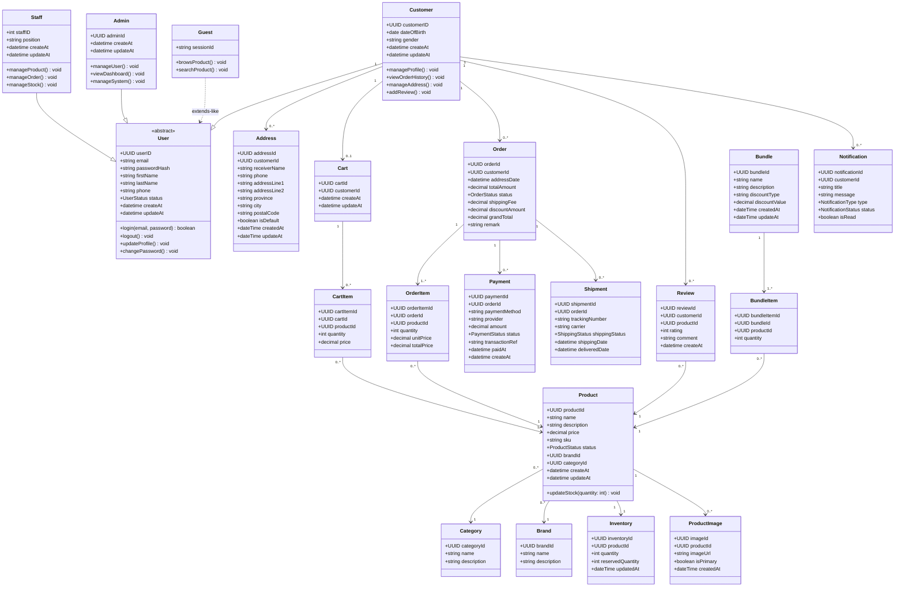
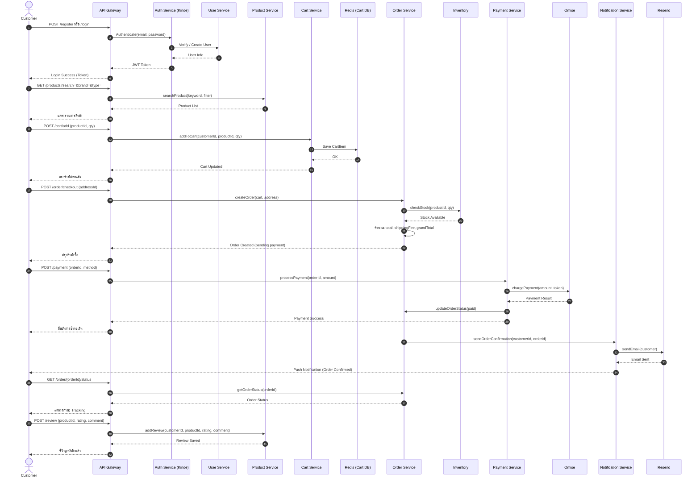
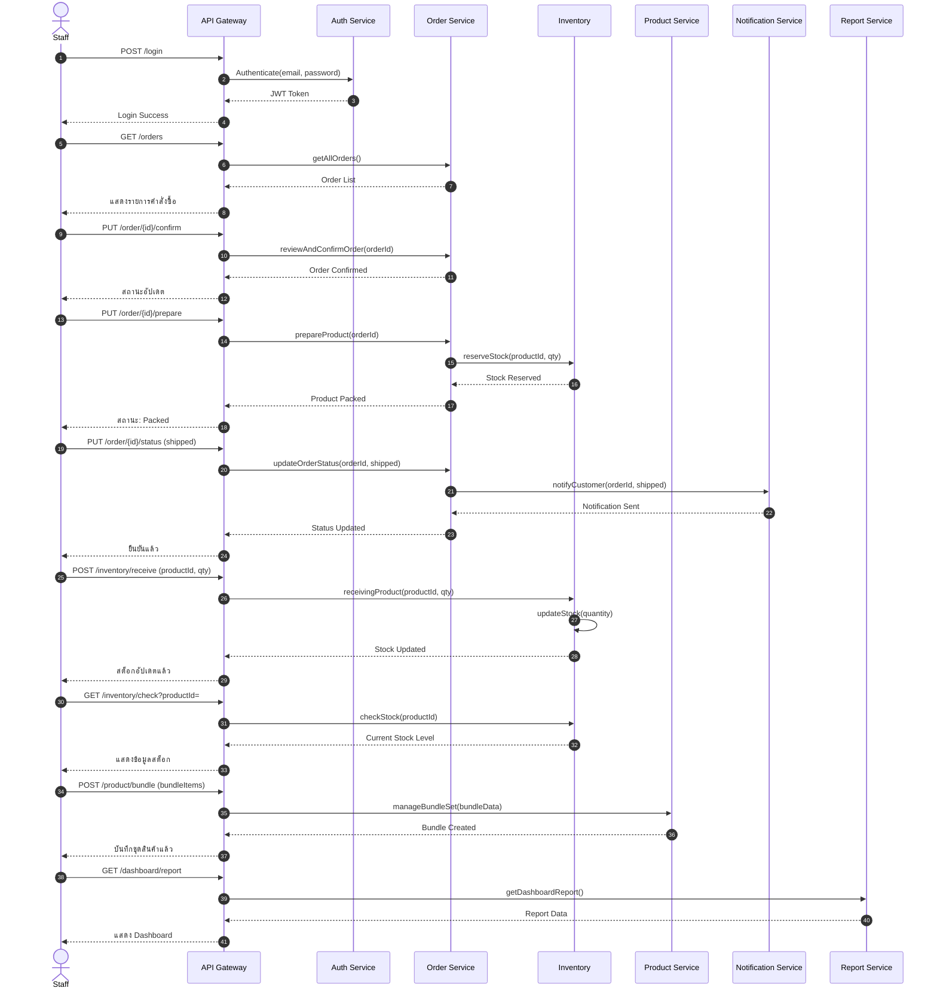
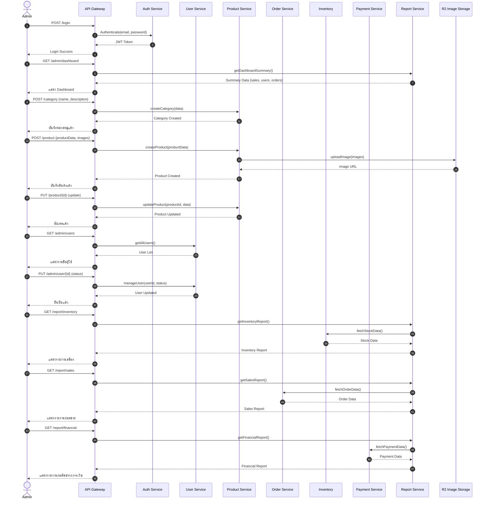
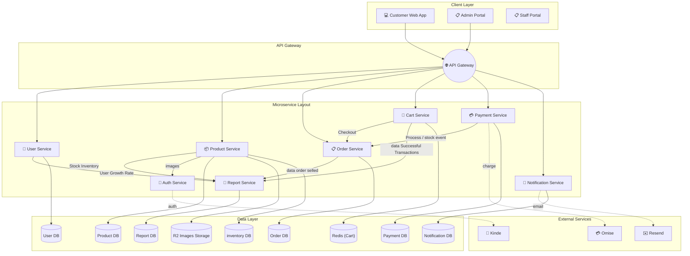

# Musicgear

# Persona Design


# Use Case Diagram

```mermaid
%% Mermaid ไม่มี usecase diagram แบบ native จริงๆ
%% เลยจำลองด้วย flowchart: actor = สี่เหลี่ยมมน, usecase = วงรี (stadium shape)
flowchart LR

    Customer(["👤 Customer"])
    Staff(["👤 Staff"])
    Guest(["👤 Guest"])
    Admin(["👤 Admin"])

    %% ===== Customer Use Cases =====
    subgraph CustomerUC["Customer"]
        direction LR
        UC_Register(("Register / Login"))
        UC_ManageAcc(("Manage account"))
        UC_Search(("Search"))
        UC_Browse(("Browse Item"))
        UC_Filter(("Filter brand type..."))
        UC_Cart(("Manage Cart"))
        UC_Compare(("Compare a product"))
        UC_Notify(("Receive Notification"))
        UC_Review(("Review(star)"))
        UC_Address(("Manage Address"))
        UC_History(("History"))
        UC_Details(("Watch details"))
        UC_Tracking(("Tracking order"))
        UC_AddCart(("Add to cart"))
        UC_Buy(("Buy Items"))
        UC_Confirm(("Confirm order"))
        UC_Pay(("Payments"))
        UC_Select(("Select"))
    end

    Customer --- UC_Register
    Customer --- UC_ManageAcc
    Customer --- UC_Browse
    Customer --- UC_Cart
    Customer --- UC_Compare
    Customer --- UC_Notify
    Customer --- UC_Address
    Customer --- UC_Details
    Customer --- UC_AddCart
    Customer --- UC_Buy
    Customer --- UC_Pay
    Customer --- UC_Review
    Customer --- UC_History
    Customer --- UC_Tracking

    UC_ManageAcc -.->|"<<extend>>"| UC_Search
    UC_Browse -.->|"<<extend>>"| UC_Filter
    UC_Buy -.->|"<<include>>"| UC_Confirm
    UC_Pay -.->|"<<include>>"| UC_Select

    %% ===== Staff Use Cases =====
    subgraph StaffUC["Staff"]
        direction LR
        UC_ReviewOrder(("Review and confirm order"))
        UC_Login2(("Login"))
        UC_Prepare(("Prepare product / pack product"))
        UC_ViewOrders(("View all order list"))
        UC_UpdateStatus(("Update order status"))
        UC_DashReport(("Manage Dashboard Report"))
        UC_CheckStock(("Check stock"))
        UC_Receiving(("Receiving product"))
        UC_StockProduct(("Manage Stock Product"))
        UC_ManageStock(("Manage stock"))
        UC_BundleSet(("Manage bundle set"))
    end

    Staff --- UC_Login2
    Staff --- UC_ReviewOrder
    Staff --- UC_Prepare
    Staff --- UC_ViewOrders
    Staff --- UC_UpdateStatus
    Staff --- UC_DashReport
    Staff --- UC_StockProduct

    UC_CheckStock -.->|"<<include>>"| UC_StockProduct
    UC_Receiving -.->|"<<include>>"| UC_StockProduct
    UC_ManageStock -.->|"<<include>>"| UC_StockProduct
    UC_StockProduct -.->|"<<extend>>"| UC_BundleSet

    %% ===== Guest Use Cases =====
    subgraph GuestUC["Guest"]
        direction LR
        UC_GSearch(("Search"))
        UC_GAddCart(("Add to cart"))
        UC_GFilter(("Filter brand type..."))
        UC_GBrowse(("Browse Item"))
    end

    Guest --- UC_GSearch
    Guest --- UC_GBrowse
    UC_GSearch -.->|"<<extend>>"| UC_GAddCart
    UC_GFilter -.->|"<<extend>>"| UC_GBrowse

    %% ===== Admin Use Cases =====
    subgraph AdminUC["Admin"]
        direction LR
        UC_ALogin(("Login"))
        UC_Dashboard(("Dashboard"))
        UC_Category(("Manage Category"))
        UC_Product(("Manage Product"))
        UC_Financial(("Financial results report"))
        UC_Inventory(("Inventory Report"))
        UC_ManageUser(("Manage User"))
        UC_SalesReport(("Sales report"))
    end

    Admin --- UC_ALogin
    Admin --- UC_Dashboard
    Admin --- UC_Category
    Admin --- UC_Product
    Admin --- UC_Financial
    Admin --- UC_Inventory
    Admin --- UC_ManageUser
    Admin --- UC_SalesReport
```


# Class Diagram



#Sequence Diagram
   1. Customer

  2. Staff

  3. Admin


#Wirefram or Prototype


# System Architecture


# Data Schema (JSON)
```json
{
  "name": "string",
  "age": "integer",
  "isActive": "boolean"
}
```

# User Acceptance Testing: UAT (Manual Testing)
