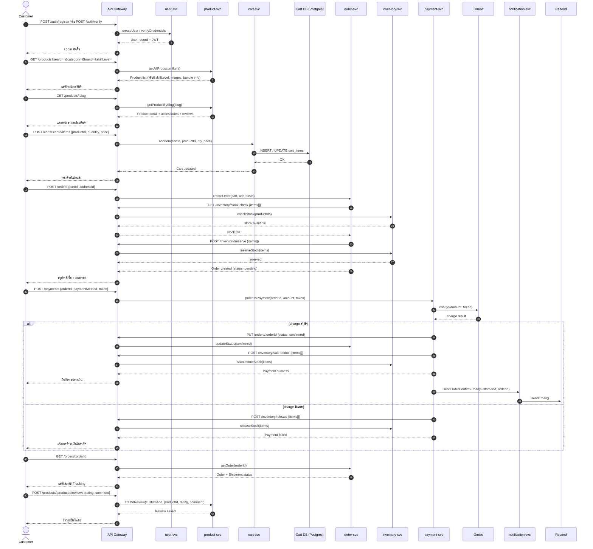
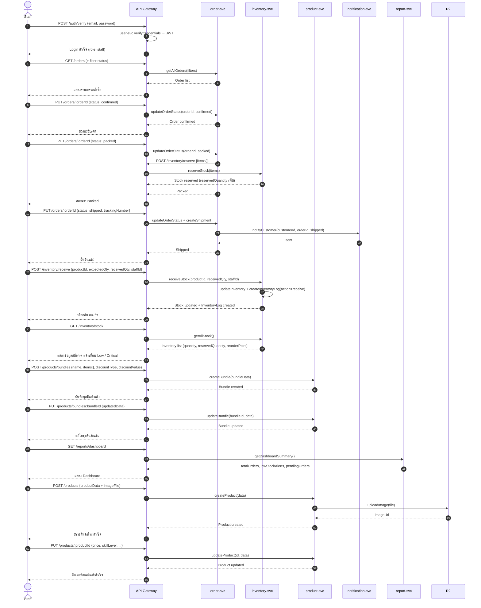
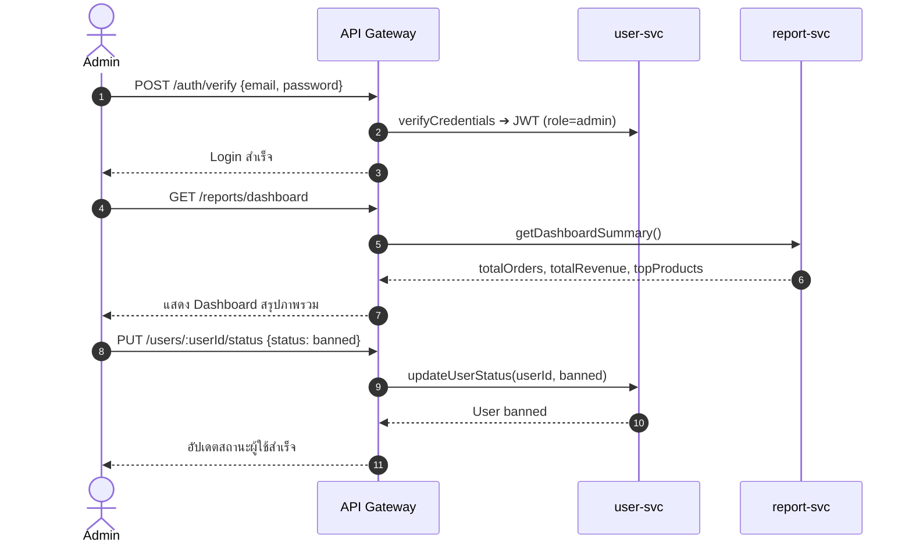
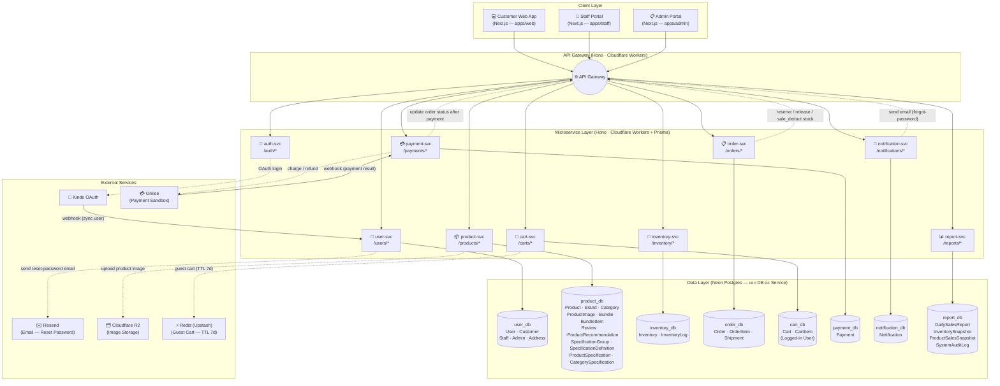

# 🎸 MusicGear — Project Design Document
> ## Project of CSI 204 Summer Semester 3/2568

> ระบบ E-Commerce สำหรับร้านขายเครื่องดนตรีและอุปกรณ์ดนตรีออนไลน์ รองรับ 3 บทบาทผู้ใช้งาน: **Customer, Staff, Admin**

github page: [GitHub Page](https://csi204.github.io/musicgear/)

---

## 📚 สารบัญ

1. [Contributors](#-contributors)
2. [หลักการและเหตุผล (Rationale)](#-หลักการและเหตุผล-rationale)
3. [วัตถุประสงค์ของโครงงาน (Objectives)](#%EF%B8%8F-วัตถุประสงค์ของโครงงาน-objectives)
4. [ขอบเขตของระบบ (System Scope)](#-หลักการและเหตุผล-rationale)
5. [แนวทางของการพัฒนาตาม SDLC (System Development Life Cycle))](#%E2%80%8D-แนวทางของการพัฒนาตาม-sdlc-system-development-life-cycle)
7. [Tech Stack](#-tech-stack)
8. [แนวทางการทดสอบ (Testing Approach)](#%EF%B8%8F-แนวทางการทดสอบ-testing-approach)
9. [ผลลัพธ์ที่คาดว่าจะได้รับ (Expected Outcomes)](#%EF%B8%8F-ผลลัพธ์ที่คาดว่าจะได้รับ-expected-outcomes)
10. [แผนการดำเนินงาน 4 สัปดาห์ (Work Plan: 4 Weeks)](#%EF%B8%8F-แผนการดำเนินงาน-4-สัปดาห์-work-plan-4-weeks)
11. [Brand Identity & Color Palette](#-brand-identity--color-palette)
12. [Requirement](#-requirment)
13. [User Personas](#-user-personas)
14. [Use Case Diagram](#-use-case-diagram)
15. [Class Diagram](#%EF%B8%8F-class-diagram)
16. [Sequence Diagrams](#-sequence-diagrams)
17. [Wireframe](#-wireframe--prototype---clik-to-inspect)
18. [System Architecture](#%EF%B8%8F-system-architecture)
19. [Data schema](#data-schema-json)
20. [User Accept Testing: UAT (Manual Testing)](#user-acceptance-testing-uat-manual-testing)

---

## 🤼 Contributors

### Group Name : องครักษ์พิทักษ์ลาบ
1. 67095474 นายธีรภัทร เนียมสุวรรณ SA, Core Backend
2. 67096366 นายปวริศ ธรรมวงษ์ Frontend, Backend lead
3. 67118456 นายเขตโสภณ อินอุตออน PM, infrastructure

---

## 💭 หลักการและเหตุผล (Rationale)

ปัจจุบันตลาดเครื่องดนตรีและอุปกรณ์ดนตรีออนไลน์มีการขยายตัวอย่างต่อเนื่องทว่าผู้ประกอบการส่วนใหญ่ยังประสบปัญหาขาดแคลนแพลตฟอร์มการจัดการร้านค้าที่ครอบคลุมและครบวงจร ตลอดจนผู้บริโภคที่เป็นมือใหม่ยังเผชิญความยุ่งยากในการเลือกซื้ออุปกรณ์ให้ตรงกับความต้องการ โครงงานนี้จึงมุ่งพัฒนาระบบบริหารจัดการร้านค้าเครื่องดนตรีออนไลน์ด้วยสถาปัตยกรรมไมโครเซอร์วิส (Microservices Architecture) ซึ่งมีความยืดหยุ่นและรองรับการขยายตัวของระบบได้ดี โดยบูรณาการระบบจัดการคลังสินค้าที่มีประสิทธิภาพ ระบบชำระเงินที่มีความปลอดภัย ตลอดจนระบบแนะนำสินค้าและการจัดเซ็ตเริ่มต้น (Bundle Set) เพื่อสร้างประสบการณ์ที่ดีและขับเคลื่อนมูลค่าทางธุรกิจอย่างยั่งยืน

---

## 🗃️ วัตถุประสงค์ของโครงงาน (Objectives)

1. เพื่อออกแบบและพัฒนาระบบบริหารจัดการร้านค้าและคลังสินค้าเครื่องดนตรีออนไลน์ (E-Commerce & WMS) ด้วยสถาปัตยกรรมไมโครเซอร์วิส (Microservices Architecture)
2. เพื่อพัฒนาระบบแนะนำสินค้าและจัดเซ็ตอุปกรณ์ดนตรี (Bundle Set) สำหรับผู้เริ่มต้น โดยพิจารณาจากระดับทักษะและงบประมาณของผู้ใช้งาน
3. เพื่อพัฒนาระบบชำระเงินที่ปลอดภัยและระบบจัดการผู้ใช้งานที่สามารถแบ่งสิทธิ์ตามหน้าที่ได้อย่างชัดเจน
4. เพื่อช่วยลดความสับสนในการเลือกซื้ออุปกรณ์ดนตรี เพิ่มความมั่นใจในการตัดสินใจซื้อ และเพิ่มประสิทธิภาพในการดำเนินงานของเจ้าหน้าที่หลังบ้าน

---

## 📑 ขอบเขตของระบบ (System Scope)

### ผู้ใช้งาน (Actors)
- [x] ลูกค้า (Customer)
- [x] พนักงาน (Staff)
- [x] ผู้ดูแลระบบ (Administrator)

### ความสามารถหลักของระบบ (Main Function)
1. การจัดการสมาชิก (Register/Login)
2. การจัดการข้อมูลสินค้า
3. การค้นหาและแสดงรายละเอียดสินค้า
4. ระบบตะกร้าสินค้า (Shopping Cart)
5. ระบบสั่งซื้อสินค้า (Order Management)
6. ระบบชำระเงิน (Simulation/Mockup - Stripe/Omise sandbox)
7. ระบบติดตามสถานะคำสั่งซื้อ
8. ระบบจัดการสินค้าและคำสั่งซื้อสำหรับ Staff/Admin
9. รายงาน/Dashboard
10. ระบบแนะนำอุปกรณ์ที่เหมาะสำหรับมือใหม่ (Beginner)
11. ระบบแนะนำสินค้าที่ใช้ร่วมกันได้ + Bundle Set
12. ระบบเปรียบเทียบสินค้า (Compare Product)

---

## 🧑‍💻 แนวทางของการพัฒนาตาม SDLC (System Development Life Cycle)

| ขั้นตอน (Phase) | รายละเอียดโดยย่อ (Brief Description) |
|---|---|
| **1.Planing** | ร่วมกันระบุปัญหา รวบรวมไอเดียและความต้องการเบื้องต้นในการทำระบบ พร้อมทั้งประเมินความคุ้มค่าและความเป็นไปได้ของโปรเจกต์ |
| **2.Analysis** | วิเคราะห์ปัญหาเชิงลึกและกำหนดวัตถุประสงค์/ขอบเขตฟังก์ชันของระบบ โดยนำ UML เช่น Use Case Diagram มาใช้ในการวิเคราะห์พฤติกรรมของผู้ใช้   |
| **3.Design** | ออกแบบโครงสร้างระบบ (System Architecture), ออกแบบฐานข้อมูลด้วย Schema และออกแบบส่วนติดต่อผู้ใช้ (UI/UX) ด้วย Figma รวมถึงการทำ Use Case /Sequence/Class Diagram |
| **4.Development** | ลงมือพัฒนา (Implementation) เขียนโค้ดระบบหลังบ้าน (Backend) ส่วนหน้าบ้าน (Frontend) และสร้างฐานข้อมูลตามที่ได้ออกแบบไว้ |
| **5.Testing** | ดำเนินการทดสอบระบบอย่างเป็นระบบ ด้วย UAT (User Acceptance Testing) เพื่อตรวจสอบความถูกต้อง |
| **6.Deployment** | นำระบบขึ้นสู่สภาพแวดล้อมจริง (Production Environment) และส่งมอบระบบให้ผู้ใช้งาน (Users) เข้าใช้งานได้อย่างเป็นทางการ |
| **7.Maintenance** | ตรวจสอบและติดตามผล (Monitoring) ประสิทธิภาพของระบบ คอยอัปเดตเวอร์ชัน แพทช์ความปลอดภัย และแก้ไขปัญหา (Bug Fixing) ที่เกิดขึ้นหลังเปิดใช้งาน |

---

## 🧰 Tech Stack

| หมวด | เทคโนโลยี | รายละเอียด |
|---|---|---|
| **Frontend** | Next.js + TypeScript | Framework: Vinext |
| **Backend** | Node.js (JavaScript) | Runtime |
| **Backend Framework** | Hono | Lightweight backend framework |
| **ORM** | Prisma (+ adapter-neon) | จัดการฐานข้อมูล |
| **Database** | PostgreSQL (Neon DB) | Serverless Postgres |
| **Storage Images** | Cloudflare R2 | ตัวเก็บรูป |
| **Caching** | Redis (Upstash) | สำหรับทำcart(caching) |
| **Resend** | Resend | ระบบ ส่งอีเมลล์เพื่อเปลี่ยนรหัสผ่าน |
| **Validation** | Zod | Validate ข้อมูล |
| **Payment** | Omise SDK | ระบบชำระเงิน |
| **Styling** | Tailwind CSS + shadcn/ui | ออกแบบ UI และ component |
| **Deployment (Frontend)** | Cloudflare Workers | โฮสต์ฝั่ง frontend |
| **Deployment (Backend)** | Cloudflare Workers | โฮสต์ฝั่ง backend |
| **DevOps** | Wrangler CLI, Git, GitHub | Deploy & version control |
| **API Testing** | Postman | ทดสอบ API |
| **Design** | Figma | ออกแบบ UI/UX |
| **Version Control** | GIT,GitHub | History,VersionControl |

---

## ⚙️ แนวทางการทดสอบ (Testing Approach)
### ประเภทการทดสอบ (Test Types)
- **User Acceptance Testing (UAT)**
### เครื่องมือที่ใช้คือ (Tools)
- **Manual Testing**
### รายละเอียดการทดสอบ (Testing Details)
- **ไม่วัดผลจากการใช้เครื่องมือทดสอบอัตโนมัติ หรือการจัดทำรายงานผลการทดสอบอย่างเป็นทางการ**
- การทดสอบการทำงานของระบบ โดยอธิบายขั้นตอนการทดสอบ ผลลัพธ์ที่คาดหวัง และผลลัพธ์ที่เกิดขึ้นจริง เพื่อแสดงให้เห็นว่าระบบสามารถทำงานได้ถูกต้องตามวัตถุประสงค์ที่กำหนดไว้ รวมถึงการทดสอบการทำงานของระบบด้วยตนเอง (Manual Testing) ตามฟังก์ชันต่าง ๆ ที่ได้พัฒนาขึ้น พร้อมทั้งสาธิตการทำงานของระบบต่อผู้สอน เพื่อยืนยันความถูกต้อง ความสมบูรณ์ และประสิทธิภาพของระบบในการใช้งานจริง

---

## 🖼️ ผลลัพธ์ที่คาดว่าจะได้รับ (Expected Outcomes)
### ระบุประโยชน์ที่คาดว่าจะได้รับจากการพัฒนาระบบ
- **ได้เว็บแอป e-commerce สำหรับขาย music gear ที่ใช้งานได้จริง(90%)ครบ flow ตั้งแต่ค้นหาสินค้า → ตะกร้า → ชำระเงิน สำเร็จ**
- **ผู้ใช้ (ลูกค้า/พนักงาน/แอดมิน) สามารถเข้าระบบตาม role ของตนเองได้ พร้อม Dashboard(admin,staff) สรุปข้อมูลเชิงวิเคราะห์สำหรับแอดมิน**
- **ระบบจัดการสต็อกสินค้าที่อัปเดตสถานะอัตโนมัติเมื่อมีการสั่งซื้อ ลดความผิดพลาดจากการจัดการสต็อกแบบ manual**
- **ทีมได้ฝึกกระบวนการพัฒนาตาม Agile/Scrum จริง (4 sprints) และได้ codebase ที่ deploy บน Cloudflare stack ตามที่ออกแบบไว้**

---

## 🗺️ แผนการดำเนินงาน 4 สัปดาห์ (Work Plan: 4 Weeks)
| สัปดาห์ (Week) | กิจกรรม (Activities) | รายละเอียดโดยย่อ (Brief Description) |
|:---:|---|---|
| **1** | **วิเคราะห์และออกแบบระบบ (Analysis & Design)** | วางแผนว่าจะทำอะไร แบ่งหน้าที่ ออกแบบdiagram ออกแบบtech stack ทำยังไงให้เว็บเร็วและ setup file |
| **2** | **พัฒนา Backend และฐานข้อมูล (Backend & Database Development)** | ทำตามwork flow ที่กำหนดไว้ และtest api เพื่อนำไปต่อกับ frontend และต่อdatabase จากนั้นdeploy |
| **3** | **พัฒนา Frontend (Frontend development)** | ทำตามprototype ที่ทำไว้ และรอต่อapi จาก backendจากนั้น deploy |
| **4** | **ทดสอบระบบและนำเสนอผลงาน (Testing & Presentation)** | เตรียมการนำเสนอ และ ทดสอบUAT ตามส่วนที่ตัวเองรับผิดชอบ |

---

## 🎨 Brand Identity & Color Palette

แนวคิด: **"Electric Stage"** — ผสานความดิบเท่ของเวทีดนตรี (สีดำ/เทาเข้ม) เข้ากับความทันสมัยของแบรนด์เทค (สีฟ้าไฟฟ้า) แล้วแต่งแต้มพลังด้วยสีอำพันแบบไฟสปอตไลต์บนเวที เพื่อสื่อถึงทั้งความพรีเมียมของเครื่องดนตรีและความเป็นแพลตฟอร์มอีคอมเมิร์ซยุคใหม่

| สี | Hex | บทบาท | การใช้งาน |
|---|---|---|---|
| 🖤 **Jet Black** | `#0B0B0E` | Primary / Base | พื้นหลังหลัก, Header, Footer, โหมดมืดของเว็บ |
| 💙 **Electric Blue** | `#2F5DFF` | Primary Accent | ปุ่ม CTA, ลิงก์, โลโก้, สถานะ active, ไอคอนหลัก |
| 🧡 **Amber Spotlight** | `#FF8A3D` | Secondary Accent | ป้ายลดราคา/โปรโมชัน, แจ้งเตือน Staff/Admin, ไฮไลต์สำคัญ |
| 🤍 **Warm Off-White** | `#F5F3EE` | Surface / Background | พื้นหลังการ์ดสินค้า, พื้นที่เนื้อหาในโหมดสว่าง |
| ⚪ **Slate Gray** | `#6B6B74` | Neutral / Text | ข้อความรอง, เส้นแบ่ง, placeholder |
| 🟢 **Success Green** | `#2BBF7A` | Feedback | สถานะสำเร็จ, ของพร้อมส่ง, Payment success |
| 🔴 **Alert Red** | `#E54848` | Feedback | สต็อกหมด, ยกเลิกออเดอร์, Error |

**โทนการใช้งานแยกตามบทบาท**
- **Customer (Web App):** พื้นหลังขาวอุ่น (`#F5F3EE`) + ฟ้าไฟฟ้าเป็นจุดเด่น ให้ความรู้สึกสะอาด เลือกซื้อง่าย
- **Staff Portal:** โทนมืด (`#0B0B0E`) + อำพันเป็นตัวเน้นงาน เพื่อเน้นการอ่านสถานะ/แจ้งเตือนได้ไว
- **Admin Portal:** โทนมืด + ฟ้าไฟฟ้า เน้นกราฟ/ดาต้า ให้ดูเป็นระบบ Dashboard ระดับโปร

---

## 📃 Requirment

Requirement หลักของระบบ (ตามเกณฑ์ - ครบทุกข้อ):
1. การสมัครสมากชิกและเข้าสู่ระบบ (Register/Login)
2. การจัดการสินค้า
3. การค้นหาและแสดงรายละเอียดสินค้า
4. ระบบตะกร้าสินค้า (Shopping Cart)
5. ระบบสั่งซื้อสินค้า (Order Management)
6. ระบบชำระเงิน (Simulation/Mockup - Stripe/Omise sandbox)
7. ระบบติดตามสถานะคำสั่งซื้อ
8. ระบบจัดการสินค้าและคำสั่งซื้อสำหรับ Staff
9. รายงาน/Dashboard
10. ระบบแนะนำอุปกรณ์ที่เหมาะสำหรับมือใหม่ (Beginner)
11. ระบบแนะนำสินค้าที่ใช้ร่วมกันได้ + Bundle Set
12. ระบบเปรียบเทียบสินค้า (Compare Product)

---

## 👥 User Personas

### 🧑‍🎤 Persona 1 — Customer: "นัท"
**อายุ:** 19 ปี | นักศึกษาปีที่ 1 | **เป้าหมาย:** เล่นกีตาร์ให้เก่ง — มือใหม่ในวงการดนตรี

> *"ผมอยากหัดเล่นดนตรีจริงจัง แต่พอหาของในเน็ตทีไรก็ตัวเลือกมันแถมสเปกอะไรก็ไม่รู้ ดูเป็นไม่ค่อยรู้ว่าแค่ไหนถึงคุ้ม"*

**🩹 Pain Points**
- ตัวเลือกสินค้าเยอะเกินไป ไม่มีคำแนะนำหรือ Guide สำหรับการเริ่มต้นที่ชัดเจน
- สินค้าที่จัดเป็นแพ็คเกจ/เซ็ตเริ่มต้นในตลาด บางครั้งอุปกรณ์ภายในเซ็ตใช้ร่วมกันไม่ได้จริง หรือใช้งานยุ่งยากเกินไปสำหรับมือใหม่
- ไม่มั่นใจในความคุ้มค่า ไม่รู้ว่าราคาที่จ่ายไปจะได้ของที่มีคุณภาพจริงไหม
- รายละเอียดสินค้ามีแต่คำศัพท์เทคนิคเฉพาะทาง อ่านแล้วเข้าใจยาก

**🎯 Needs & Motivations**
- ระบบช่วยคัดเลือกหรือแนะนำสินค้าเบื้องต้นที่ตอบโจทย์ Level มือใหม่
- แพ็คเกจเริ่มต้นแบบ "กล่องเดียวจบพร้อมเล่น" ไม่ต้องไปหาซื้ออุปกรณ์เสริมแยกทีหลัง
- ฟีเจอร์เปรียบเทียบสเปกและราคาแบบเข้าใจง่าย เพื่อช่วยในการตัดสินใจ
- มีการติดป้าย (Tag) หรือแบ่งหมวดหมู่ที่ชัดเจนว่าสินค้าชิ้นไหนเหมาะสำหรับระดับ "Beginner"

---

### 🔧 Persona 2 — Staff: "นอท"
**อายุ:** 23 ปี | พนักงานจัดการสินค้าและคลัง | **เป้าหมาย:** จัดการข้อมูลสินค้าในระบบ จัดเตรียมสินค้าตามออเดอร์ และหยิบแพ็กสินค้าส่งออกได้ถูกต้อง รวดเร็ว 100%

> *"ลูกค้าชอบสั่งสินค้าหลายชิ้นพร้อมกันเพราะกลัวว่าซื้อไปแล้วจะใช้ด้วยกันไม่ได้ แต่ในระบบคลังเราต้องมานั่งแยกเช็กทีละชิ้น ถ้าออเดอร์ไหนรายละเอียดไม่ชัดเจน ตอนไปหยิบของจะวุ่นวายและเสียเวลามาก"*

**🩹 Pain Points**
- **เสียเวลาตรวจสอบความถูกต้อง:** เวลาลูกค้าสั่งซื้อสินค้าแบบจัดเซ็ต (Bundle) พนักงานต้องคอยจำหรือมานั่งเปิดเช็กคู่มือเองว่าเซ็ตนี้ประกอบด้วยอะไรรวมกันบ้าง เสี่ยงต่อการหยิบอุปกรณ์ย่อย (เช่น สายแจ็ค, ปิ๊ก, ขาตั้ง) ตกหล่นหรือผิดรุ่น
- **ระบบสต็อกไม่แจ้งเตือนสินค้าขาดล่วงหน้า:** สต็อกสินค้าแบบเซ็ตจัดการได้ยาก ถ้ารายการใดรายการหนึ่งใน Bundle ของหมด ระบบจะไม่แจ้งเตือน ทำให้พนักงานต้องเดินไปเช็กที่ชั้นวางเองตอนเตรียมออเดอร์แล้วพบว่าไม่มีของ ทำให้เสียเวลาและออเดอร์ค้างส่ง

**🎯 Needs & Motivations**
- ต้องการระบบที่แสดงสินค้าส่วนประกอบ (Bundle Items) ภายใต้เซ็ตสินค้าในใบสั่งซื้อและแสดงใบพิมพ์จัดเตรียมสินค้า (Packing Slip) เพื่อให้หยิบและบรรจุสินค้าลงกล่องได้รวดเร็วโดยไม่ต้องเดาเอง
- หน้าสรุปคลังสินค้าที่แสดงสถานะความพร้อมของเซ็ตสินค้า (พร้อมประกอบ / วัตถุดิบไม่พอ) และหน้า Dashboard ที่สรุปสถานะการเตือนภัยสต็อกต่ำ (Low Stock Alert) เพื่อเตรียมเบิกสั่งของล่วงหน้า

---

### 📊 Persona 3 — Admin: "แนท"
**อายุ:** 29 ปี | ผู้ดูแลระบบ | **เป้าหมาย:** จัดการผู้ใช้งานในระบบ (Staff/Customer) และดูรายงานสรุปยอดขาย การเงิน เพื่อนำไปวิเคราะห์ภาพรวมธุรกิจ

> *"การมีข้อมูลสรุปที่ชัดเจนและจัดการผู้ใช้งานได้ง่าย จะช่วยให้มองเห็นภาพรวมของธุรกิจและสามารถดูแลความปลอดภัยของระบบได้ดีขึ้น"*

**🩹 Pain Points**
- **ขาดภาพรวมข้อมูลที่เข้าใจง่าย:** ปัจจุบันต้องมานั่งสรุปข้อมูลเองจากหลายๆ หน้า ไม่สามารถดูภาพรวมของระบบหรือ Export ออกมาเป็นรายงานเพื่อใช้งานต่อได้ทันที
- **วิเคราะห์การขายและสต็อกลำบาก:** การจะดูว่าสินค้าไหนขายดีเพื่อนำมาจัดโปรโมชัน หรือคำนวณว่าควรสั่งสต็อกเพิ่มไหม เป็นเรื่องที่ทำได้ยากและเสียเวลามาก เพราะระบบเดิมไม่รองรับการสกัดข้อมูลเชิงลึก

**🎯 Needs & Motivations**
- รายงานรายงานสินค้าขายดี (Sale performance)
- รายงานการเงิน (Financial)
- รายงานสินค้าคงคลัง (Inventory Report) ที่สรุปได้ว่าสินค้าคู่ไหนมักจะถูกซื้อร่วมกัน เพื่อนำมาปรับปรุงข้อมูลหน้าให้ตรงกับผู้ใช้งาน

---

## 🧩 Use Case Diagram

```mermaid
flowchart LR

    %% ── Actors ──
    User(["👤 User\n(abstract)"])
    Guest(["👤 Guest"])
    Customer(["👤 Customer"])
    Staff(["👤 Staff"])
    Admin(["👤 Admin"])

    %% Actor Generalization — ลูกศรชี้จากลูกไปหาพ่อแม่ (standard UML)
    Customer -.->|"<<generalize>>"| User
    Staff    -.->|"<<generalize>>"| User
    Admin    -.->|"<<generalize>>"| User

    %% ── Shared Use Cases (User level — ทุก role ใช้ร่วมกันผ่าน inheritance) ──
    subgraph SharedUC["User (Shared)"]
        direction TB
        UC_Login(("Login / Register"))
        UC_Logout(("Logout"))
        UC_UpdateProfile(("Update Profile"))
        UC_ChangePassword(("Change Password"))
    end

    User --- UC_Login
    User --- UC_Logout
    User --- UC_UpdateProfile
    User --- UC_ChangePassword

    UC_ChangePassword -.->|"<<extend>>"| UC_UpdateProfile

    %% ── Guest Use Cases ──
    subgraph GuestUC["Guest"]
        direction TB
        UC_GBrowse(("Browse Product"))
        UC_GSearch(("Search Product"))
        UC_GFilter(("Filter Product"))
        UC_GAddCart(("Add to Cart"))
        UC_GViewDetail(("View Product Detail"))
    end

    Guest --- UC_GBrowse
    Guest --- UC_GSearch
    Guest --- UC_GAddCart
    UC_GFilter -.->|"<<extend>>"| UC_GBrowse
    UC_GFilter -.->|"<<extend>>"| UC_GSearch
    UC_GViewDetail -.->|"<<extend>>"| UC_GBrowse
    UC_GViewDetail -.->|"<<extend>>"| UC_GSearch
    UC_GAddCart -.->|"<<include>>"| UC_GViewDetail

    %% ── Customer Use Cases ──
    subgraph CustomerUC["Customer"]
        direction TB
        UC_Browse(("Browse Product"))
        UC_Search(("Search Product"))
        UC_Filter(("Filter Product"))
        UC_ViewDetail(("View Product Detail"))
        UC_ManageCart(("Manage Cart"))
        UC_AddCart(("Add to Cart"))
        UC_ManageAddress(("Manage Address"))
        UC_Checkout(("Checkout"))
        UC_Pay(("Payment (Omise)"))
        UC_SelectPayMethod(("Select Payment Method"))
        UC_TrackOrder(("Track Order"))
        UC_OrderHistory(("Order History"))
        UC_Notification(("Receive Notification"))
    end

    Customer --- UC_Browse
    Customer --- UC_Search
    Customer --- UC_ManageCart
    Customer --- UC_ManageAddress
    Customer --- UC_Checkout
    Customer --- UC_Pay
    Customer --- UC_TrackOrder
    Customer --- UC_OrderHistory
    Customer --- UC_Notification

    UC_Filter -.->|"<<extend>>"| UC_Browse
    UC_Filter -.->|"<<extend>>"| UC_Search
    UC_ViewDetail -.->|"<<extend>>"| UC_Browse
    UC_ViewDetail -.->|"<<extend>>"| UC_Search
    UC_AddCart -.->|"<<include>>"| UC_ViewDetail
    UC_ManageCart -.->|"<<include>>"| UC_AddCart
    UC_Checkout -.->|"<<include>>"| UC_ManageAddress
    UC_Pay -.->|"<<include>>"| UC_SelectPayMethod
    UC_Pay -.->|"<<include>>"| UC_Checkout
    UC_TrackOrder -.->|"<<extend>>"| UC_OrderHistory

    %% ── Staff Use Cases ──
    subgraph StaffUC["Staff"]
        direction TB
        UC_ManageProduct(("Manage Product"))
        UC_ManageCategory(("Manage Category"))
        UC_ManageBrand(("Manage Brand"))
        UC_ViewOrders(("View Order List"))
        UC_ConfirmOrder(("Confirm Order"))
        UC_PrepareOrder(("Prepare / Pack Order"))
        UC_UpdateOrderStatus(("Update Order Status"))
        UC_CheckStock(("Check Stock"))
        UC_ReceiveProduct(("Receive Product"))
        UC_AdjustStock(("Adjust Stock"))
        UC_ManageStock(("Manage Stock Product"))
        UC_ManageBundle(("Manage Bundle Set"))
        UC_StaffDashboard(("View Dashboard"))
    end

    Staff --- UC_ManageProduct
    Staff --- UC_ManageCategory
    Staff --- UC_ManageBrand
    Staff --- UC_ViewOrders
    Staff --- UC_ConfirmOrder
    Staff --- UC_PrepareOrder
    Staff --- UC_UpdateOrderStatus
    Staff --- UC_ManageStock
    Staff --- UC_ManageBundle
    Staff --- UC_StaffDashboard

    UC_CheckStock   -.->|"<<include>>"| UC_ManageStock
    UC_ReceiveProduct -.->|"<<include>>"| UC_ManageStock
    UC_AdjustStock  -.->|"<<include>>"| UC_ManageStock
    UC_ManageBundle -.->|"<<extend>>"| UC_ManageStock
    UC_ConfirmOrder -.->|"<<include>>"| UC_ViewOrders
    UC_PrepareOrder -.->|"<<include>>"| UC_CheckStock
    UC_ManageCategory -.->|"<<extend>>"| UC_ManageProduct
    UC_ManageBrand -.->|"<<extend>>"| UC_ManageProduct
    UC_UpdateOrderStatus -.->|"<<include>>"| UC_ViewOrders

    %% ── Admin Use Cases ──
    subgraph AdminUC["Admin"]
        direction TB
        UC_AdminDashboard(("Admin Dashboard"))
        UC_ManageUser(("Manage User"))
        UC_SalesReport(("Sales Report"))
        UC_InventoryReport(("Inventory Report"))
        UC_FinancialReport(("Financial Report"))
    end

    Admin --- UC_AdminDashboard
    Admin --- UC_ManageUser
    Admin --- UC_SalesReport
    Admin --- UC_InventoryReport
    Admin --- UC_FinancialReport

    UC_ManageUser -.->|"<<include>>"| UC_AdminDashboard
    UC_SalesReport  -.->|"<<include>>"| UC_AdminDashboard
    UC_InventoryReport -.->|"<<include>>"| UC_AdminDashboard
    UC_FinancialReport -.->|"<<include>>"| UC_AdminDashboard
```



---

## 🏗️ Class Diagram

```mermaid
classDiagram

    class User {
        +String userId
        +String email
        +String passwordHash
        +String firstName
        +String lastName
        +String phone
        +Role role
        +UserStatus status
        +DateTime createdAt
        +DateTime updatedAt
        +login(email: String, password: String) JWT
        +logout(userId: String) boolean
        +updateProfile(userId: String, data: Json) User
        +changePassword(oldPwd: String, newPwd: String) boolean
    }

    class Customer {
        +String customerId
        +DateTime dateOfBirth
        +Gender gender
        +DateTime createdAt
        +DateTime updatedAt
        +manageProfile(data: Json) Customer
        +manageAddress(data: Json) Address
        +viewOrderHistory(customerId: String) Order[]
        +trackOrder(orderId: String) OrderStatus
        +addReview(productId: String, rating: Int, comment: String) Review
        +compareProducts(productIds: String[]) Product[]
        +subscribeBackInStock(productId: String) Notification
        +viewNotifications(customerId: String) Notification[]
    }

    class Staff {
        +String staffId
        +String position
        +DateTime createdAt
        +DateTime updatedAt
        +viewOrders() Order[]
        +confirmOrder(orderId: String) Order
        +prepareOrder(orderId: String) Order
        +updateOrderStatus(orderId: String, status: OrderStatus) Order
        +receivingProduct(productId: String, qty: Int) InventoryLog
        +checkStock(productId: String) Inventory
        +adjustStock(productId: String, qty: Int, reason: String) InventoryLog
        +createBundleSet(bundleData: Json) Bundle
        +updateBundleSet(bundleId: String, data: Json) Bundle
        +viewDashboard() Json
    }

    class Admin {
        +String adminId
        +DateTime createdAt
        +DateTime updatedAt
        +manageUser(userId: String, action: String) User
        +viewDashboard() Json
        +createProduct(productData: Json) Product
        +updateProduct(productId: String, data: Json) Product
        +deleteProduct(productId: String) boolean
        +manageCategory(action: String, data: Json) Category
        +manageBrand(action: String, data: Json) Brand
        +generateSalesReport(dateRange: Json) DailySalesReport[]
        +generateInventoryReport() Json
        +generateFinancialReport(dateRange: Json) Json
        +manageSystem(config: Json) boolean
    }

    class Address {
        +String addressId
        +String customerId
        +String receiverName
        +String phone
        +String addressLine1
        +String addressLine2
        +String province
        +String city
        +String postalCode
        +Boolean isDefault
        +DateTime createdAt
        +DateTime updatedAt
        +setAsDefault(addressId: String) Address
        +validate(addressData: Json) boolean
    }

    class Cart {
        +String cartId
        +String customerId
        +String sessionId
        +DateTime createdAt
        +DateTime updatedAt
        +addItem(productId: String, qty: Int) CartItem
        +removeItem(cartItemId: String) boolean
        +updateItemQty(cartItemId: String, qty: Int) CartItem
        +clear(cartId: String) boolean
        +calculateTotal() Decimal
        +checkout(addressId: String) Order
        +mergeGuestCart(sessionId: String) Cart
    }

    class CartItem {
        +String cartItemId
        +String cartId
        +String productId
        +String color
        +String title
        +String imageUrl
        +String brand
        +Int quantity
        +Decimal price
        +updateQuantity(qty: Int) CartItem
        +getSubtotal() Decimal
    }

    class Order {
        +String orderId
        +String customerId
        +String addressId
        +String paymentMethod
        +DateTime orderDate
        +Json shippingAddressSnapshot
        +Decimal totalAmount
        +Decimal shippingFee
        +Decimal discountAmount
        +Decimal grandTotal
        +OrderStatus status
        +String remark
        +createOrder(cart: Cart, addressId: String) Order
        +cancelOrder() Order
        +calculateTotal() Decimal
        +getStatus() OrderStatus
        +getOrderItems() OrderItem[]
    }

    class OrderItem {
        +String orderItemId
        +String orderId
        +String productId
        +Int quantity
        +Decimal unitPrice
        +Decimal totalPrice
        +getSubtotal() Decimal
    }

    class Review {
        +String reviewId
        +String customerId
        +String productId
        +Int rating
        +String comment
        +DateTime createdAt
        +create(customerId: String, productId: String, rating: Int, comment: String) Review
        +update(rating: Int, comment: String) Review
        +delete(reviewId: String) boolean
    }

    class Notification {
        +String notificationId
        +String customerId
        +String productId
        +String title
        +String message
        +NotificationType type
        +NotificationStatus status
        +Boolean isRead
        +DateTime createdAt
        +send(notificationId: String) boolean
        +markAsRead(notificationId: String) Notification
        +markAllAsRead(customerId: String) Int
    }

    class Payment {
        +String paymentId
        +String orderId
        +PaymentMethod paymentMethod
        +String provider
        +Decimal amount
        +PaymentStatus status
        +String transactionRef
        +DateTime paidAt
        +DateTime createdAt
        +processPayment(method: PaymentMethod, token: String) Payment
        +refund(paymentId: String) Payment
        +getStatus() PaymentStatus
        +verifyWebhook(payload: Json) boolean
    }

    class Shipment {
        +String shipmentId
        +String orderId
        +String trackingNumber
        +String carrier
        +ShippingStatus shippingStatus
        +DateTime shippingDate
        +DateTime deliveredDate
        +updateStatus(status: ShippingStatus) Shipment
        +generateTrackingNumber() String
        +getTrackingInfo() Json
    }

    class Product {
        +String productId
        +String name
        +String slug
        +String description
        +Decimal price
        +String sku
        +ProductStatus status
        +SkillLevel skillLevel
        +String brandId
        +String categoryId
        +DateTime createdAt
        +DateTime updatedAt
        +Decimal originalPrice
        +generateSlug(name: String) String
        +getImages() ProductImage[]
        +getInventory() Inventory
        +getBundles() Bundle[]
        +getReviews() Review[]
        +getAverageRating() Decimal
        +getBeginnerRecommendations() Product[]
        +getCompatibleProducts() Product[]
        +updateStock(quantity: Int, action: InventoryAction) InventoryLog
    }

    class Category {
        +String categoryId
        +String name
        +String description
        +getProducts() Product[]
        +getProductCount() Int
    }

    class Brand {
        +String brandId
        +String name
        +String description
        +getProducts() Product[]
    }

    class Inventory {
        +String inventoryId
        +String productId
        +Int quantity
        +Int reservedQuantity
        +Int reorderPoint
        +Int maxCapacity
        +DateTime updatedAt
        +checkAvailable(qty: Int) boolean
        +getAvailableQty() Int
        +reserve(qty: Int) Inventory
        +release(qty: Int) Inventory
        +deduct(qty: Int) Inventory
        +isOutOfStock() boolean
    }

    class InventoryLog {
        +String id
        +String productId
        +Int beforeQty
        +Int afterQty
        +Int changeQty
        +InventoryAction action
        +String staffId
        +DateTime createdAt
        +create(productId: String, before: Int, after: Int, action: InventoryAction, staffId: String) InventoryLog
        +getHistory(productId: String) InventoryLog[]
    }

    class ProductImage {
        +String imageId
        +String productId
        +String imageUrl
        +Boolean isPrimary
        +Int sortOrder
        +DateTime createdAt
        +upload(file: String) ProductImage
        +delete(imageId: String) boolean
        +reorder(sortOrder: Int) ProductImage
        +setPrimary(imageId: String) ProductImage
    }

    class Bundle {
        +String bundleId
        +String name
        +String description
        +String imageUrl
        +DiscountType discountType
        +Decimal discountValue
        +DateTime createdAt
        +DateTime updatedAt
        +calculateDiscount(originalPrice: Decimal) Decimal
        +getBundlePrice() Decimal
        +getItems() BundleItem[]
        +checkAllInStock() boolean
        +isAvailable() boolean
    }

    class BundleItem {
        +String bundleItemId
        +String bundleId
        +String productId
        +Int quantity
        +validate() boolean
        +checkStock() boolean
    }

    class DailySalesReport {
        +String id
        +DateTime reportDate
        +Int totalOrders
        +Decimal totalRevenue
        +DateTime updatedAt
        +generateDaily(date: DateTime) DailySalesReport
        +getReportByDateRange(startDate: DateTime, endDate: DateTime) DailySalesReport[]
        +calculateTotalRevenue() Decimal
    }

    class SystemAuditLog {
        +String logId
        +String eventType
        +String referenceId
        +Json payload
        +DateTime createdAt
        +logEvent(type: String, refId: String, data: Json) SystemAuditLog
        +getLogsByType(type: String, limit: Int) SystemAuditLog[]
    }
    class SpecificationGroup {
        +String groupId
        +String name
        +Int sortOrder
        +DateTime createdAt
        +DateTime updatedAt
        +getDefinitions() SpecificationDefinition[]
    }

    class SpecificationDefinition {
        +String definitionId
        +String groupId
        +String name
        +Int sortOrder
        +DateTime createdAt
        +DateTime updatedAt
        +getValues(productId: String) ProductSpecification[]
    }

    class ProductSpecification {
        +String productId
        +String definitionId
        +String value
        +upsert(productId: String, definitionId: String, value: String) ProductSpecification
    }

    class CategorySpecification {
        +String categoryId
        +String definitionId
        +assign(categoryId: String, definitionId: String) CategorySpecification
        +remove(categoryId: String, definitionId: String) boolean
    }

    class ProductRecommendation {
        +String recommendationId
        +String productId
        +String recommendedId
        +Float score
        +DateTime createdAt
        +getRecommendations(productId: String) Product[]
        +upsert(productId: String, recommendedId: String, score: Float) ProductRecommendation
    }


    %% ── Inheritance ──
    User <|-- Customer
    User <|-- Staff
    User <|-- Admin

    %% ── Customer relations ──
    Customer "1"    --> "0..*" Address
    Customer "1"    --> "0..1" Cart
    Customer "1"    --> "0..*" Order
    Customer "1"    --> "0..*" Review
    Customer "1"    --> "0..*" Notification

    %% ── Cart relations ──
    Cart     "1"    --> "0..*" CartItem
    CartItem "0..*" --> "1"    Product

    %% ── Order relations ──
    Order    "1"    --> "1..*" OrderItem
    Order    "1"    --> "0..*" Payment
    Order    "1"    --> "0..1" Shipment
    Order    "0..*" --> "1"    Address
    OrderItem "0..*" --> "1"   Product

    %% ── Review relation ──
    Review "0..*" --> "1" Product

    %% ── Notification relation ──
    Notification "0..*" --> "0..1" Product

    %% ── Product relations ──
    Product "0..*" --> "1"    Category
    Product "0..*" --> "1"    Brand
    Product "1"    --> "1"    Inventory
    Product "1"    --> "0..*" ProductImage
    Product "1"    --> "0..*" InventoryLog

    %% ── InventoryLog ──
    InventoryLog "0..*" --> "0..1" Staff

    %% ── Bundle relations ──
    Bundle     "1"    --> "1..*" BundleItem
    BundleItem "0..*" --> "1"    Product

    %% ── Specification relations ──
    SpecificationGroup "1" --> "0..*" SpecificationDefinition
    SpecificationDefinition "0..*" --> "0..*" Product
    CategorySpecification "0..*" --> "1" Category
    CategorySpecification "0..*" --> "1" SpecificationDefinition
    ProductSpecification "0..*" --> "1" Product
    ProductSpecification "0..*" --> "1" SpecificationDefinition
    ProductRecommendation "0..*" --> "1" Product

```



---

## 🔁 Sequence Diagrams

### 1. Customer



### 2. Staff



### 3. Admin



---

## 🖥️ System Architecture



---

## 🎯 Wireframe / Prototype - Clik to inspect
[](https://www.figma.com/design/RSQ1FfYVF5qJZzgem9ntBt/Untitled?node-id=0-1&t=H5nnEYQtm8Cw6YVe-1)

# Data Schema (JSON)

> **หมายเหตุ:** แต่ละ microservice มีฐานข้อมูล PostgreSQL (Neon) แยกกันคนละ DB ตามหลัก Database-per-Service โดย soft reference (ไม่มี FK ข้าม service)

```json
{
  "[user_db] users": {
    "description": "ตารางหลักของผู้ใช้ทุก role — Single base table + extension table (table-per-subtype). userId ใช้ UUID ปกติ (อาจเป็น Kinde sub สำหรับ OAuth login)",
    "fields": {
      "userId":       { "type": "string", "primaryKey": true, "default": "uuid()", "note": "Kinde sub หรือ UUID" },
      "email":        { "type": "string", "unique": true, "required": true },
      "passwordHash": { "type": "string", "required": true },
      "firstName":    { "type": "string", "required": true },
      "lastName":     { "type": "string", "required": true },
      "phone":        { "type": "string", "required": false },
      "role":         { "type": "enum", "values": ["customer", "staff", "admin"], "required": true },
      "status":       { "type": "enum", "values": ["active", "inactive", "banned"], "default": "active" },
      "createdAt":    { "type": "datetime", "default": "now()" },
      "updatedAt":    { "type": "datetime", "default": "now()" }
    }
  },

  "[user_db] customers": {
    "description": "Extension table ของ users เฉพาะ role=customer",
    "fields": {
      "customerId":   { "type": "string", "primaryKey": true, "references": "users.userId", "onDelete": "Cascade" },
      "dateOfBirth":  { "type": "date", "required": false },
      "gender":       { "type": "enum", "values": ["male", "female", "other", "prefer_not_to_say"], "required": false },
      "createdAt":    { "type": "datetime", "default": "now()" },
      "updatedAt":    { "type": "datetime", "default": "now()" }
    }
  },

  "[user_db] staff": {
    "description": "Extension table ของ users เฉพาะ role=staff",
    "fields": {
      "staffId":      { "type": "string", "primaryKey": true, "references": "users.userId", "onDelete": "Cascade" },
      "position":     { "type": "string", "required": true, "example": "Warehouse / Packing" },
      "createdAt":    { "type": "datetime", "default": "now()" },
      "updatedAt":    { "type": "datetime", "default": "now()" }
    }
  },

  "[user_db] admins": {
    "description": "Extension table ของ users เฉพาะ role=admin",
    "fields": {
      "adminId":      { "type": "string", "primaryKey": true, "references": "users.userId", "onDelete": "Cascade" },
      "createdAt":    { "type": "datetime", "default": "now()" },
      "updatedAt":    { "type": "datetime", "default": "now()" }
    }
  },

  "[user_db] addresses": {
    "fields": {
      "addressId":    { "type": "UUID", "primaryKey": true },
      "customerId":   { "type": "string", "references": "customers.customerId", "onDelete": "Cascade", "required": true },
      "receiverName": { "type": "string", "required": true },
      "phone":        { "type": "string", "required": true },
      "addressLine1": { "type": "string", "required": true },
      "addressLine2": { "type": "string", "required": false },
      "province":     { "type": "string", "required": true },
      "city":         { "type": "string", "required": true },
      "postalCode":   { "type": "string", "required": true },
      "isDefault":    { "type": "boolean", "default": false },
      "createdAt":    { "type": "datetime", "default": "now()" },
      "updatedAt":    { "type": "datetime", "default": "now()" }
    }
  },

  "[product_db] brands": {
    "fields": {
      "brandId":      { "type": "UUID", "primaryKey": true },
      "name":         { "type": "string", "unique": true, "required": true },
      "description":  { "type": "text", "required": false }
    }
  },

  "[product_db] categories": {
    "fields": {
      "categoryId":   { "type": "UUID", "primaryKey": true },
      "name":         { "type": "string", "unique": true, "required": true },
      "description":  { "type": "text", "required": false }
    }
  },

  "[product_db] category_specifications": {
    "description": "ตารางจับคู่ระหว่าง Category กับ SpecificationDefinition เพื่อกำหนดว่าแต่ละหมวดหมู่ต้องการสเปกอะไรบ้าง",
    "fields": {
      "categoryId":   { "type": "UUID", "references": "categories.categoryId", "onDelete": "Cascade", "required": true },
      "definitionId": { "type": "UUID", "references": "specification_definitions.definitionId", "onDelete": "Cascade", "required": true }
    },
    "__primaryKey": ["categoryId", "definitionId"]
  },

  "[product_db] products": {
    "fields": {
      "productId":     { "type": "UUID", "primaryKey": true },
      "name":          { "type": "string", "required": true },
      "slug":          { "type": "string", "unique": true, "required": true, "note": "generate จาก name เช่น 'Yamaha F310' → 'yamaha-f310' ใช้เป็น URL /products/:slug" },
      "description":   { "type": "text", "required": false },
      "price":         { "type": "decimal(10,2)", "required": true, "min": 0 },
      "originalPrice": { "type": "decimal(10,2)", "required": false, "note": "ราคาเต็มก่อนลดราคา" },
      "sku":           { "type": "string", "unique": true, "required": true },
      "status":        { "type": "enum", "values": ["active", "inactive", "discontinued", "out_of_stock"], "default": "active" },
      "skillLevel":    { "type": "enum", "values": ["beginner", "intermediate", "advanced"], "required": false, "note": "ใช้สำหรับ Beginner Recommendation (Req 10)" },
      "brandId":       { "type": "UUID", "references": "brands.brandId", "required": true },
      "categoryId":    { "type": "UUID", "references": "categories.categoryId", "required": true },
      "createdAt":     { "type": "datetime", "default": "now()" },
      "updatedAt":     { "type": "datetime", "default": "now()" }
    }
  },

  "[product_db] product_images": {
    "fields": {
      "imageId":      { "type": "UUID", "primaryKey": true },
      "productId":    { "type": "UUID", "references": "products.productId", "required": true },
      "imageUrl":     { "type": "string", "required": true, "note": "URL ไปยัง Cloudflare R2" },
      "isPrimary":    { "type": "boolean", "default": false },
      "sortOrder":    { "type": "integer", "default": 0, "note": "0 = รูปปก, เรียงน้อย→มาก" },
      "createdAt":    { "type": "datetime", "default": "now()" }
    }
  },

  "[product_db] bundles": {
    "description": "เซ็ตสินค้า Bundle Set ที่ Staff สร้างเพื่อจำหน่ายเป็นชุด (Req 11)",
    "fields": {
      "bundleId":      { "type": "UUID", "primaryKey": true },
      "name":          { "type": "string", "required": true },
      "description":   { "type": "text", "required": false },
      "discountType":  { "type": "enum", "values": ["percentage", "fixed_amount"], "required": true },
      "discountValue": { "type": "decimal(10,2)", "required": true, "min": 0 },
      "imageUrl":      { "type": "string", "required": false, "note": "รูปภาพชุด Bundle" },
      "createdAt":     { "type": "datetime", "default": "now()" },
      "updatedAt":     { "type": "datetime", "default": "now()" }
    }
  },

  "[product_db] bundle_items": {
    "fields": {
      "bundleItemId": { "type": "UUID", "primaryKey": true },
      "bundleId":     { "type": "UUID", "references": "bundles.bundleId", "required": true },
      "productId":    { "type": "UUID", "references": "products.productId", "required": true },
      "quantity":     { "type": "integer", "required": true, "min": 1 }
    }
  },

  "[product_db] reviews": {
    "fields": {
      "reviewId":   { "type": "UUID", "primaryKey": true },
      "customerId": { "type": "UUID", "required": true, "note": "Soft ref → user-svc" },
      "productId":  { "type": "UUID", "references": "products.productId", "required": true },
      "rating":     { "type": "integer", "min": 1, "max": 5, "required": true },
      "comment":    { "type": "text", "required": false },
      "createdAt":  { "type": "datetime", "default": "now()" }
    }
  },

  "[product_db] product_recommendations": {
    "description": "ตารางแนะนำสินค้าที่คล้ายกันหรือใช้ร่วมกัน",
    "fields": {
      "recommendationId": { "type": "UUID", "primaryKey": true },
      "productId":        { "type": "UUID", "references": "products.productId", "onDelete": "Cascade", "required": true },
      "recommendedId":    { "type": "UUID", "references": "products.productId", "onDelete": "Cascade", "required": true },
      "score":            { "type": "float", "default": 1.0 },
      "createdAt":        { "type": "datetime", "default": "now()" }
    },
    "__unique": ["productId", "recommendedId"]
  },

  "[product_db] specification_groups": {
    "description": "กลุ่มของสเปกสินค้า เช่น 'Body', 'Neck', 'Electronics'",
    "fields": {
      "groupId":   { "type": "UUID", "primaryKey": true },
      "name":      { "type": "string", "unique": true, "required": true },
      "sortOrder": { "type": "integer", "default": 0 },
      "createdAt": { "type": "datetime", "default": "now()" },
      "updatedAt": { "type": "datetime", "default": "now()" }
    }
  },

  "[product_db] specification_definitions": {
    "description": "คำจำกัดความสเปกรายข้อในแต่ละกลุ่ม เช่น 'Top Wood', 'Fretboard Material'",
    "fields": {
      "definitionId": { "type": "UUID", "primaryKey": true },
      "groupId":      { "type": "UUID", "references": "specification_groups.groupId", "onDelete": "Cascade", "required": true },
      "name":         { "type": "string", "required": true },
      "sortOrder":    { "type": "integer", "default": 0 },
      "createdAt":    { "type": "datetime", "default": "now()" },
      "updatedAt":    { "type": "datetime", "default": "now()" }
    },
    "__unique": ["groupId", "name"]
  },

  "[product_db] product_specifications": {
    "description": "ค่าสเปกจริงของสินค้าแต่ละชิ้น",
    "fields": {
      "productId":    { "type": "UUID", "references": "products.productId", "onDelete": "Cascade", "required": true },
      "definitionId": { "type": "UUID", "references": "specification_definitions.definitionId", "onDelete": "Cascade", "required": true },
      "value":        { "type": "string", "required": true, "example": "Mahogany" }
    },
    "__primaryKey": ["productId", "definitionId"],
    "__indexes": ["definitionId", "value"]
  },

  "[inventory_db] inventory": {
    "fields": {
      "inventoryId":      { "type": "UUID", "primaryKey": true },
      "productId":        { "type": "UUID", "unique": true, "required": true, "note": "Soft ref → product-svc" },
      "quantity":         { "type": "integer", "default": 0, "min": 0 },
      "reservedQuantity": { "type": "integer", "default": 0, "min": 0, "note": "จองตอน checkout ก่อน payment confirm" },
      "reorderPoint":     { "type": "integer", "default": 0, "note": "จุด threshold สำหรับ Low/Critical Stock Alert ใน Staff Dashboard" },
      "maxCapacity":      { "type": "integer", "default": 100, "note": "ความจุสูงสุดของคลังสินค้าสำหรับสินค้านี้" },
      "updatedAt":        { "type": "datetime (timestamptz)", "default": "now()" }
    }
  },

  "[inventory_db] inventory_logs": {
    "description": "เก็บประวัติทุกครั้งที่สต็อกถูกแก้ไข (รับของ/จอง/คืน/ตัดขาย)",
    "fields": {
      "id":        { "type": "UUID", "primaryKey": true },
      "productId": { "type": "UUID", "required": true, "note": "Soft ref → product-svc" },
      "orderId":   { "type": "UUID", "required": false, "note": "Soft ref → order-svc (ใช้ตอน reserve/release/sale_deduct)" },
      "beforeQty": { "type": "integer", "required": true },
      "afterQty":  { "type": "integer", "required": true },
      "changeQty": { "type": "integer", "required": true, "note": "afterQty - beforeQty" },
      "action":    { "type": "enum", "values": ["receive", "adjust", "reserve", "release", "sale_deduct"],
                     "note": "receive=รับของเข้า, adjust=แก้มือ, reserve=จอง, release=คืนตอน payment fail, sale_deduct=ตัดขายสำเร็จ" },
      "staffId":   { "type": "UUID", "required": false, "note": "Soft ref → user-svc / null ถ้า action จากระบบอัตโนมัติ" },
      "createdAt": { "type": "datetime (timestamptz)", "default": "now()" },
      "__indexes": ["productId", "orderId", "staffId", "createdAt"]
    }
  },

  "[cart_db] carts": {
    "description": "Cart เก็บใน PostgreSQL (Neon) ไม่ใช่ Redis — รองรับทั้ง logged-in user และ guest",
    "fields": {
      "cartId":     { "type": "UUID", "primaryKey": true },
      "customerId": { "type": "UUID", "required": false, "note": "Soft ref → user-svc / null = guest cart" },
      "sessionId":  { "type": "string", "required": false, "note": "ใช้กรณี guest ที่ยังไม่ login" },
      "createdAt":  { "type": "datetime", "default": "now()" },
      "updatedAt":  { "type": "datetime", "default": "now()" }
    }
  },

  "[cart_db] cart_items": {
    "fields": {
      "cartItemId": { "type": "UUID", "primaryKey": true },
      "cartId":     { "type": "UUID", "references": "carts.cartId", "required": true },
      "productId":  { "type": "UUID", "required": true, "note": "Soft ref → product-svc" },
      "quantity":   { "type": "integer", "required": true, "min": 1 },
      "price":      { "type": "decimal(10,2)", "required": true, "note": "snapshot ราคา ณ ตอนเพิ่มลงตะกร้า" },
      "color":      { "type": "string", "required": false },
      "title":      { "type": "string", "required": false },
      "imageUrl":   { "type": "string", "required": false },
      "brand":      { "type": "string", "required": false }
    }
  },

  "[order_db] orders": {
    "fields": {
      "orderId":                 { "type": "UUID", "primaryKey": true },
      "customerId":              { "type": "UUID", "required": true, "note": "Soft ref → user-svc" },
      "addressId":               { "type": "UUID", "required": true, "note": "Soft ref → user-svc address" },
      "orderDate":               { "type": "datetime", "default": "now()" },
      "shippingAddressSnapshot": { "type": "json", "required": true, "note": "freeze ที่อยู่ ณ วันสั่งซื้อ" },
      "totalAmount":             { "type": "decimal(10,2)", "required": true },
      "shippingFee":             { "type": "decimal(10,2)", "default": 0 },
      "discountAmount":          { "type": "decimal(10,2)", "default": 0 },
      "grandTotal":              { "type": "decimal(10,2)", "required": true },
      "status":                  { "type": "enum", "values": ["pending", "confirmed", "packed", "shipped", "delivered", "cancelled", "refunded"], "default": "pending" },
      "paymentMethod":           { "type": "string", "default": "online", "required": true },
      "remark":                  { "type": "text", "required": false }
    }
  },

  "[order_db] order_items": {
    "fields": {
      "orderItemId": { "type": "UUID", "primaryKey": true },
      "orderId":     { "type": "UUID", "references": "orders.orderId", "required": true },
      "productId":   { "type": "UUID", "required": true, "note": "Soft ref → product-svc" },
      "quantity":    { "type": "integer", "required": true, "min": 1 },
      "unitPrice":   { "type": "decimal(10,2)", "required": true, "note": "snapshot ราคา ณ วันสั่งซื้อ" },
      "totalPrice":  { "type": "decimal(10,2)", "required": true }
    }
  },

  "[order_db] shipments": {
    "fields": {
      "shipmentId":     { "type": "UUID", "primaryKey": true },
      "orderId":        { "type": "UUID", "references": "orders.orderId", "unique": true, "required": true },
      "trackingNumber": { "type": "string", "required": false },
      "carrier":        { "type": "string", "required": false },
      "shippingStatus": { "type": "enum", "values": ["preparing", "shipped", "in_transit", "delivered", "returned"], "default": "preparing" },
      "shippingDate":   { "type": "datetime", "required": false },
      "deliveredDate":  { "type": "datetime", "required": false }
    }
  },

  "[payment_db] payments": {
    "fields": {
      "paymentId":      { "type": "UUID", "primaryKey": true },
      "orderId":        { "type": "UUID", "required": true, "note": "Soft ref → order-svc" },
      "paymentMethod":  { "type": "enum", "values": ["credit_card", "promptpay", "bank_transfer"], "required": true },
      "provider":       { "type": "string", "default": "omise" },
      "amount":         { "type": "decimal(10,2)", "required": true },
      "status":         { "type": "enum", "values": ["pending", "paid", "failed", "refunded"], "default": "pending" },
      "transactionRef": { "type": "string", "required": false },
      "paidAt":         { "type": "datetime", "required": false },
      "createdAt":      { "type": "datetime", "default": "now()" }
    }
  },

  "[notification_db] notifications": {
    "fields": {
      "notificationId": { "type": "UUID", "primaryKey": true },
      "customerId":     { "type": "UUID", "required": true, "note": "Soft ref → user-svc" },
      "orderId":        { "type": "UUID", "required": false, "note": "Soft ref → order-svc" },
      "productId":      { "type": "UUID", "required": false, "note": "Soft ref → product-svc (ใช้กรณี back_in_stock/promotion)" },
      "title":          { "type": "string", "required": true },
      "message":        { "type": "text", "required": true },
      "type":           { "type": "enum", "values": ["order_update", "back_in_stock", "promotion", "system"], "required": true },
      "status":         { "type": "enum", "values": ["sent", "pending", "failed"], "default": "pending" },
      "isRead":         { "type": "boolean", "default": false },
      "isStaffAlert":   { "type": "boolean", "default": false, "note": "true = แสดงใน Staff Portal (Low Stock Alert, Order ใหม่)" },
      "createdAt":      { "type": "datetime", "default": "now()" },
      "__indexes":      ["orderId", "[isStaffAlert, isRead]"]
    }
  },

  "[report_db] daily_sales_reports": {
    "description": "ข้อมูลยอดขายรวมรายวัน สร้าง/อัปเดตโดย report-svc เมื่อมี order เข้ามา",
    "fields": {
      "id":           { "type": "UUID", "primaryKey": true },
      "reportDate":   { "type": "date", "unique": true },
      "totalOrders":  { "type": "integer", "default": 0 },
      "totalRevenue": { "type": "decimal(10,2)", "default": 0 },
      "updatedAt":    { "type": "datetime", "default": "now()" }
    }
  },

  "[report_db] product_sales_snapshots": {
    "description": "ข้อมูลยอดขายแยกรายสินค้าต่อวัน ใช้สร้าง Top Products report ใน Admin Dashboard",
    "fields": {
      "id":           { "type": "UUID", "primaryKey": true },
      "reportDate":   { "type": "date", "required": true },
      "productId":    { "type": "UUID", "required": true, "note": "Soft ref → product-svc" },
      "productName":  { "type": "string", "required": true },
      "category":     { "type": "string", "required": true },
      "quantitySold": { "type": "integer", "default": 0 },
      "revenue":      { "type": "decimal(10,2)", "default": 0 },
      "updatedAt":    { "type": "datetime", "default": "now()" },
      "__unique":     "[reportDate, productId]"
    }
  },

  "[report_db] inventory_snapshots": {
    "description": "Snapshot สต็อกสินค้าสำหรับ Inventory Report ใน Admin — อัปเดตเมื่อ inventory เปลี่ยน",
    "fields": {
      "id":           { "type": "UUID", "primaryKey": true },
      "productId":    { "type": "UUID", "unique": true, "required": true, "note": "Soft ref → product-svc" },
      "productName":  { "type": "string", "required": true },
      "category":     { "type": "string", "default": "Uncategorized" },
      "stockLevel":   { "type": "integer", "default": 0 },
      "reorderPoint": { "type": "integer", "default": 0 },
      "status":       { "type": "string", "note": "'In Stock' | 'Low' | 'Critical'" },
      "updatedAt":    { "type": "datetime", "default": "now()" }
    }
  },

  "[report_db] system_audit_logs": {
    "description": "บันทึก event ทุกประเภทที่เกิดในระบบ ใช้สำหรับ audit trail และ debug",
    "fields": {
      "logId":       { "type": "UUID", "primaryKey": true },
      "eventType":   { "type": "string", "required": true, "example": "order_created, inventory_adjusted" },
      "referenceId": { "type": "UUID", "required": true, "note": "ID ของ Order หรือ Product ที่เกี่ยวข้อง" },
      "payload":     { "type": "json", "required": true },
      "createdAt":   { "type": "datetime", "default": "now()" }
    }
  }
}
```


# User Acceptance Testing (UAT) — MusicGear Hub

**โครงงาน:** MusicGear Hub (CSI204 Group Project)  
**วันที่จัดทำเอกสาร:** 16 กรกฎาคม 2569  
**รูปแบบการทดสอบ:** Manual Testing — ผู้พัฒนาระบบสาธิตการทำงานพร้อมอธิบายผลการทดสอบและหลักฐานประกอบต่อผู้สอน

### ขั้นตอนที่ 1: วิเคราะห์ Persona
ระบบ MusicGear Hub มีผู้ใช้งานหลัก 3 กลุ่ม (Persona) ซึ่งแต่ละกลุ่มมีสิทธิ์การเข้าถึงและวัตถุประสงค์การใช้งานต่างกัน:

| Persona | ขอบเขตการทดสอบหลัก |
|---|---|
| Admin | จัดการหมวดหมู่/สินค้า, จัดการผู้ใช้, ดูรายงานภาพรวม (Sales/Inventory/Financial) |
| Staff | จัดการคำสั่งซื้อ (confirm/pack/ship), จัดการสต็อกและการรับสินค้า, จัดการ Bundle |
| Customer | สมัคร/login, ค้นหา-เปรียบเทียบสินค้า, ตะกร้า, checkout, ชำระเงิน, ติดตามออเดอร์, รีวิว |

### ขั้นตอนที่ 2: หลักการออกแบบ UAT Test Case
Test Case แต่ละรายการประกอบด้วยองค์ประกอบดังนี้:
*   **TC ID** — รหัสอ้างอิงเฉพาะของ Test Case (แยก prefix ตาม Persona: UAT-A = Admin, UAT-S = Staff, UAT-C = Customer)
*   **Feature** — ฟีเจอร์ที่ทดสอบ
*   **ขั้นตอนการทดสอบ** — วิธีการทดสอบทีละขั้นตอน
*   **Test Data** — ข้อมูลนำเข้าที่ใช้ทดสอบ
*   **ผลลัพธ์ที่คาดหวัง (Expected Result)** — ผลลัพธ์ที่ระบบควรแสดงหากทำงานถูกต้อง
*   **ผลลัพธ์จริง (Actual Result)** — กรอกระหว่างการทดสอบจริง
*   **Status** — Pass / Fail

### ขั้นตอนที่ 3: ดำเนินการทดสอบ (Test Cases ตามบทบาทผู้ใช้งาน)

#### 📊 Admin

| รหัสทดสอบ | รายการทดสอบ | สถานะ | ขั้นตอนการทดสอบ | ผลลัพธ์ที่คาดหวัง | ผลลัพธ์จริง | ปัญหา / ข้อผิดพลาด | รายละเอียดของปัญหา |
|---|---|---|---|---|---|---|---|
| UAT-A01 | Login | Pass | login ด้วย account role=admin | loginสำเร็จ | Login สำเร็จ | - | - |
| UAT-A02 | Access Control | Fail | ลอง login ด้วย customer/staff account แล้วเข้า URL ของ Admin ตรงๆ | ผู้ใช้ที่ไม่มีสิทธิ์ (customer/staff) หรือหลัง logout แล้ว ต้องเข้าถึง Admin Portal ไม่ได้ | เมื่อ Login ด้วย account ที่ไม่ใช่ admin ยังสามารถไปหน้า admin protal ได้หากรู้ Url แต่จะเข้าใช้งานไม่ได้เนื่องจากติดเรื่องสิทธิ์การเข้าถึง | ปัญหาด้านความปลอดภัย | role อื่นที่ไม่ใช่ admin ยังสามารถไปหน้า admin portal ได้หากรู้ url แต่แค่ login ไม่ได้หากไม่ใช่ role admin |
| UAT-A03 | View Dashboard | pass | เข้าหน้า dashboard หลัก | เข้าใช้งานหน้า Dashboard แล้วแสดงข้อมูลสรุปทุกส่วนครบถ้วน | เข้าใช้งานหน้า Dashboard ได้ | - | - |
| UAT-A04 | Manage Product — Create | Pass | เพิ่มสินค้าใหม่ พร้อมอัปโหลดรูปภาพ | เพิ่มสินค้าใหม่พร้อมรูปภาพสำเร็จ และแสดงในรายการสินค้าทันที | เพิ่มสินค้าใหม่พร้อมรูปได้ และมีรายการสินค้าเพิ่มมาในรายการ | - | - |
| UAT-A05 | Manage Product — Edit | Pass | แก้ไขราคา/รายละเอียด /skillLevel สินค้าเดิม | แก้ไขราคา/รายละเอียด/skillLevel แล้วบันทึกสำเร็จ ข้อมูลอัปเดตถูกต้อง | สามารถแก้ไขราคา, รายละเอียด, skill Lvl ได้ | - | - |
| UAT-A06 | Manage Product — Set SkillLevel | Pass | ตั้งค่า skillLevel = beginner ให้สินค้า | ตั้งค่า skillLevel = beginner สำเร็จ และแสดงผลถูกต้องหน้า product | สินค้าที่ตั้งค่า skill Lvl beginner ไปแสดงอยู่ที่ส่วนอุปกรณ์มือใหม่ | - | - |
| UAT-A07 | Manage User — View List | Pass | เข้าหน้ารายชื่อผู้ใช้ทั้งหมด | แสดงรายชื่อผู้ใช้ทั้งหมดครบถ้วน | สามารถเห็นรายชื่อผู้ใช้ทั้งหมดที่มีได้ | - | - |
| UAT-A08 | Export Report | Pass | เข้าหน้ารายงานแล้วกดออกรายงานจากนั้นเลือก ดูตัวอย่าง หรือ dowload csv,pdf | ได้เอกสารรายงานและสามารถดูตัวอย่างได้ | ได้เอกสารรายงานและสามารถดูตัวอย่างได้ | - | - |
| UAT-A09 | Sales Report | pass | เข้าหน้ารายงานยอดขาย เลือกช่วงวันที่ | เลือกช่วงวันที่แล้วแสดงรายงานยอดขายถูกต้องตามช่วงที่เลือก | เข้าหน้ารายงานยอดขายได้ เลือกช่วงวันที่แล้วแสดงข้อมูลถูกต้อง | - | - |
| UAT-A10 | Inventory Report | pass | เข้าหน้ารายงานสต็อก | เข้าหน้ารายงานสต็อกแล้วแสดงข้อมูลคงเหลือถูกต้องครบถ้วน | เข้าหน้ารายงานสต็อกได้ แสดงข้อมูลถูกต้อง | - | - |
| UAT-A11 | Financial Report | pass | เข้าหน้ารายงานการเงิน | เข้าหน้ารายงานการเงินแล้วแสดงข้อมูลรายรับ/รายจ่ายถูกต้อง | เข้าหน้ารายงานการเงินได้ แสดงข้อมูลถูกต้อง | - | - |

#### 🔧 Staff

| รหัสทดสอบ | รายการทดสอบ | สถานะการทดสอบ | ผลลัพธ์ที่คาดหวัง | ขั้นตอนการทดสอบ | ผลลัพธ์จริง | ปัญหา / ข้อผิดพลาด | รายละเอียดของปัญหา |
|---|---|---|---|---|---|---|---|
| UAT-S01 | Login | Pass | Login ด้วย account role=staff สำเร็จ เข้าสู่ระบบได้ปกติ | login ด้วย account role=staff | Login ด้วย account role=staff สำเร็จ | - | - |
| UAT-S02 | Access Control | Fail | ผู้ใช้ที่ไม่มีสิทธิ์ customer เข้า URL ของ Staff ตรงๆ ไม่ได้ | ลอง login ด้วย customer account แล้วเข้า URL ของ Staff ตรงๆ | สามารถเข้ามาถึงหน้า staff portal ได้แต่ไม่สามารถล็อกอินได้เนื่องจากไม่สิทธิ์ในการเข้าถึง | ปัญหาด้านความปลอดภัย | ผู้ใช้ role customer สามารถเข้ามาถึงหน้า staff portal ได้ด้วย url แต่ไม่สามารถ login ได้ |
| UAT-S03 | View All Orders | Pass | แสดงรายการ order ทั้งหมดครบถ้วน | เข้าหน้า order | เข้าหน้า order แล้วมีรายการ order แสดงครบถ้วน | - | - |
| UAT-S04 | Confirm Order | Pass | เปลี่ยนสถานะ order จาก pending → confirmed สำเร็จ | เลือก order สถานะ pending แล้วกด Confirm | สามารถกดรับหรือยืนยันออเดอร์ลูกค้าได้ | - | - |
| UAT-S05 | Prepare / Pack (reserve stock) | Pass | เปลี่ยนสถานะเป็น preparing และตัดสต็อกสินค้าตามจำนวนที่สั่ง | เปิด order ที่ confirmed แล้ว กด "Prepare" | สามารถเปลี่ยนสถานะออเดอร์ได้ตามที่คาดหวัง | - | - |
| UAT-S06 | Packing Slip / Bundle Awareness | Pass | แสดงรายการสินค้าที่อยู่ใน bundle ครบทุกชิ้นสำหรับแพ็ค | เปิด order ที่มีสินค้าเป็นชุด bundle | สามารถดูรายการออเดอร์ที่เป็นสินค้า bundle ได้ | - | - |
| UAT-S07 | Update Status → Shipping | Pass | สถานะเปลี่ยนเป็น shipping สำเร็จ | เปลี่ยนสถานะเป็น shipping | สามารถเปลี่ยนสถานะเป็นกำลังจัดส่งได้สำหรับสินค้าที่อยู่แพ็คแล้ว | - | - |
| UAT-S08 | Check Stock / Low Stock Alert | pass | เข้าหน้า Inventory แล้วระบบเตือนสินค้าใกล้หมดถูกต้อง | เข้าหน้า Inventory ดูสต็อกสินค้า | หน้า Inventory มีเตือนว่าสินค้าใกล้หมดหรือหมดแล้ว | - | - |
| UAT-S09 | Receiving Product (รับของเข้าสต็อก) | pass | กรอกจำนวนสินค้าที่รับเข้าแล้วกด Confirm สต็อกอัปเดตถูกต้อง | กรอกจำนวนสินค้าที่รับเข้า กด Confirm | กรอกจำนวนสินค้าที่รับเข้าแล้วกด Confirm สต็อกอัปเดตถูกต้อง | - | - |
| UAT-S10 | Receiving — Discrepancy Warning | pass | หาก receivedQty ≠ expectedQty ระบบต้องแจ้งเตือนความคลาดเคลื่อน | รับของเข้าโดยที่ receivedQty ≠ expectedQty | รับของเข้าโดย receivedQty ≠ expectedQty ระบบแจ้งเตือนความคลาดเคลื่อนถูกต้อง | - | - |
| UAT-S11 | Check  Bundle Detail | pass | ดูรายละเอียด bundle แสดงข้อมูลสินค้าที่ประกอบอยู่ในชุดครบถ้วน | ดูรายละเอียดbundle | ดูรายละเอียด bundle แสดงข้อมูลครบถ้วน | - | - |
| UAT-S12 | Staff Dashboard | pass | เข้าหน้า Dashboard แล้วแสดงข้อมูลสรุปสำหรับ Staff ครบถ้วน | เข้าหน้า Dashboard | เข้าหน้า Dashboard แสดงข้อมูลครบถ้วน | - | - |

#### 🧑‍🎤 Customer

| รหัสทดสอบ | รายการทดสอบ | สถานะการทดสอบ | ผลลัพธ์ที่คาดหวัง | ขั้นตอนการทดสอบ | ผลลัพธ์จริง | ปัญหา / ข้อผิดพลาด | รายละเอียดของปัญหา |
|---|---|---|---|---|---|---|---|
| UAT-C01 | Register | pass | กรอกอีเมล/รหัสผ่าน/ชื่อ-นามสกุล แล้วสมัครสมาชิกสำเร็จ | กรอกอีเมล/รหัสผ่าน/ชื่อ-นามสกุล แล้วกด Register | กรอกอีเมล/รหัสผ่าน/ชื่อ-นามสกุล แล้ว Register สำเร็จ | - | - |
| UAT-C02 | Login | pass | กรอก email/password ที่ถูกต้องแล้ว login สำเร็จ | กรอก email/password ที่ถูกต้อง แล้วกด Login | กรอก email/password ที่ถูกต้องแล้ว Login สำเร็จ | - | - |
| UAT-C03 | Login (negative) | pass | กรอก password ผิด ระบบต้องแจ้งเตือนและไม่อนุญาตให้เข้าสู่ระบบ | กรอก password ผิด | กรอก password ผิด ระบบแจ้งเตือนและไม่ให้เข้าสู่ระบบตามที่ควร | - | - |
| UAT-C04 | Forgot Password | fail | ระบบส่งอีเมลรีเซ็ตรหัสผ่านไปยังอีเมลที่ลงทะเบียนไว้ | กรอก email ที่ลงทะเบียนไว้ กด Reset Password | สามารถรีเซ็ตรหัสผ่านได้ | ระบบทำงานไม่ตรงตามความต้องการ | Resend ยังอยู่ใน Sandbox mode ทำให้ส่งอีเมลได้เฉพาะ email ของเจ้าของ account Resend เท่านั้น |
| UAT-C05 | Browse & Search Product | pass | พิมพ์คำค้นหาแล้วแสดงสินค้าที่เกี่ยวข้อง เช่น "guitar" ต้องเจอสินค้าประเภทกีตาร์ | พิมพ์คำค้นหาในช่อง search เช่น "guitar" | พิมพ์คำค้นหาแล้วแสดงสินค้าที่เกี่ยวข้อง เช่น "guitar" ต้องเจอสินค้าประเภทกีตาร์ | - | - |
| UAT-C06 | Filter Product | pass | เลือก filter brand/category แล้วแสดงสินค้าตรงตามเงื่อนไขที่เลือก | เลือก filter brand / category | เลือก filter brand/category แล้วแสดงสินค้าตรงตามเงื่อนไข | - | - |
| UAT-C07 | View Product Detail | pass | คลิกเข้าไปดูสินค้า 1 ชิ้น แสดงรายละเอียดครบถ้วนถูกต้อง | คลิกเข้าไปดูสินค้า 1 ชิ้น | คลิกดูสินค้า 1 ชิ้น แสดงรายละเอียดถูกต้องครบถ้วน | - | - |
| UAT-C08 | Compare Product | pass | เลือกสินค้า 2 ชิ้นขึ้นไปแล้วแสดงตารางเปรียบเทียบถูกต้อง | เลือกสินค้า 2 ชิ้นขึ้นไปเพื่อเปรียบเทียบ | เลือกสินค้า 2 ชิ้นขึ้นไปเปรียบเทียบได้ถูกต้อง | - | - |
| UAT-C09 | Bundle / Accessories Recommendation | fail | แสดงรายการ accessories/bundle ครบตามที่กำหนด | เปิดหน้าสินค้า ดูส่วน Accessories แนะนำ | มีรายการ bundle จริงและ acessories สามารถเพิ่มได้ และสั่งซื้อได้ | ปัญหาเกี่ยวกับการใช้งาน / ปัญหาเกี่ยวกับข้อมูล | ในหน้ารายการ bundle ดึงรายการ product มาไม่ครบ |
| UAT-C10 | Add to Cart | pass | กด "Add to cart" จากหน้ารายละเอียดสินค้าแล้วเพิ่มลงตะกร้าสำเร็จ | กด "Add to cart" จากหน้ารายละเอียดสินค้า | กด Add to cart จากหน้ารายละเอียดสินค้า เพิ่มลงตะกร้าสำเร็จ | - | - |
| UAT-C11 | Manage Cart | pass | เพิ่ม/ลด/ลบสินค้าในตะกร้าแล้วยอดรวมอัปเดตถูกต้อง | เพิ่ม/ลด/ลบสินค้าในตะกร้า | เพิ่ม/ลด/ลบสินค้าในตะกร้าได้ถูกต้อง | - | - |
| UAT-C12 | Manage Address | pass | เพิ่มที่อยู่จัดส่งใหม่และตั้งเป็น default สำเร็จ | เพิ่มที่อยู่จัดส่งใหม่ และตั้งเป็น default | เพิ่มที่อยู่จัดส่งใหม่และตั้งเป็น default สำเร็จ | - | - |
| UAT-C13 | Checkout | pass | เลือกที่อยู่จัดส่งแล้วดำเนินการ checkout สำเร็จ ไม่มี error | กด checkout จากตะกร้า เลือกที่อยู่จัดส่ง | กด checkout ตะกร้าได้สำเร็จ | - | - |
| UAT-C14 | Payment — สำเร็จ (Omise sandbox) | pass | เลือกบัตร sandbox แล้วชำระเงินสำเร็จ และสร้าง order | เลือกวิธีชำระเงิน กรอกข้อมูลบัตร sandbox | ระบบ paymentสามารถใช้งานได้ตามความต้องการ | - | - |
| UAT-C15 | Order Tracking | pass | เข้าหน้า My Orders แล้วเห็นสถานะ order ของตนเองเท่านั้น | เข้าหน้า "My Orders" ดูสถานะ order ที่สั่งไว้ | ระบบ tracking order สามารถติดตามได้ | - | - |
| UAT-C16 | Order History | pass | แสดงประวัติคำสั่งซื้อทั้งหมดของบัญชีตนเองครบถ้วน | เข้าดูประวัติคำสั่งซื้อทั้งหมด | สามารถดูประวัติสินค้าได้ทั้งหมดของผู้ใช้ | - | - |

### ขั้นตอนที่ 4: สรุปผลการทดสอบ
จากเอกสาร UAT ที่ทำการทดสอบและรายงานปัญหาที่เกิดขึ้นได้ดังนี้

| Persona | จำนวน Test Case ทั้งหมด | Pass | Fail |
|---|---|---|---|
| Admin | 11 | 10 | 1 |
| Staff | 12 | 11 | 1 |
| Customer | 16 | 14 | 2 |
| **รวม** | **39** | **35** | **4** |

### ตารางสรุปปัญหาที่พบ (Issue Summary)

| Issue ID | รายละเอียดปัญหา | ประเภทปัญหา | ระดับความสำคัญ |
|---|---|---|---|
| ISS-001 | role อื่นที่ไม่ใช่ admin ยังสามารถไปหน้า admin portal ได้หากรู้ url แต่แค่ login ไม่ได้หากไม่ใช่ role admin | ปัญหาด้านความปลอดภัย | Critical |
| ISS-002 | ผู้ใช้ role customer สามารถเข้ามาถึงหน้า staff portal ได้ด้วย url แต่ไม่สามารถ login ได้ | ปัญหาด้านความปลอดภัย | Critical |
| ISS-003 | issue Resend ยังอยู่ใน Sandbox mode ทำให้ส่งอีเมลได้เฉพาะ email ของเจ้าของ account Resend เท่านั้น | ระบบทำงานไม่ตรงตามความต้องการ | High |
| ISS-004 | ในหน้ารายการ bundle ดึงรายการ product มาไม่ครบ | ปัญหาเกี่ยวกับการใช้งาน / ปัญหาเกี่ยวกับข้อมูล | High |

*อ้างอิงจากผลการทดสอบ: UAT-A02, UAT-S02, UAT-C04, UAT-C09*

### สรุปผลการประเมิน UAT
จากผลการทดสอบการยอมรับของผู้ใช้งาน (User Acceptance Testing: UAT) อ้างอิงรหัสการทดสอบ UAT-A02, UAT-S02, UAT-C04 และ UAT-C09 พบว่าระบบมีเคสที่ผ่านการทดสอบจำนวน 35 รายการ จากทั้งหมด 39 รายการ คิดเป็นร้อยละ 89.74%

อย่างไรก็ตาม ระบบยังคงตรวจพบข้อผิดพลาดสำคัญที่ต้องได้รับการแก้ไขก่อนการส่งมอบหรือเปิดใช้งานจริง โดยแบ่งเป็นปัญหาระดับ Critical 2 รายการ ในส่วนของระบบความปลอดภัยและการควบคุมสิทธิ์การเข้าถึงหน้าจัดการข้อมูลผ่าน URL (Routing Guard) ของผู้ดูแลระบบและพนักงาน และปัญหาระดับ High 2 รายการ ในส่วนของข้อจำกัดบริการส่งอีเมลแจ้งเตือน (Resend API) และความถูกต้องในการดึงข้อมูลสินค้าจัดเซ็ต (Bundle Set) คณะผู้พัฒนาจึงเห็นควรให้ดำเนินการปรับปรุงและแก้ไขประเด็นปัญหาทั้งหมดข้างต้นให้เสร็จสิ้น เพื่อให้ระบบมีความเสถียรและปลอดภัยสูงสุดก่อนการเผยแพร่สู่สภาพแวดล้อมจริง
